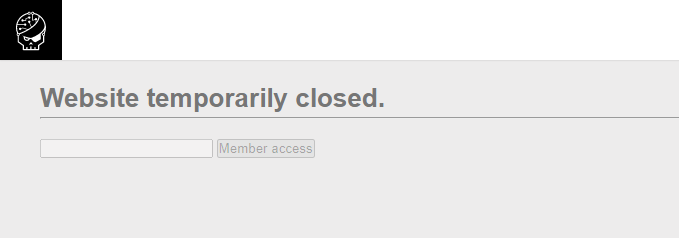

# Challenge: HTML - disabled buttons
## Người làm:   
    Nguyễn Ngọc Trưởng - 19522440
## Link: 
    https://www.root-me.org/en/Challenges/Web-Client/HTML-disabled-buttons
- Giao diện web mở đầu

- Đọc mã nguồn của trang web ta thấy 2 thẻ input đều có thuộc tính disable, ta xóa chúng đi

- Điền thông tin bất kì vào ô input

## Kết quả password là `HTMLCantStopYou`

