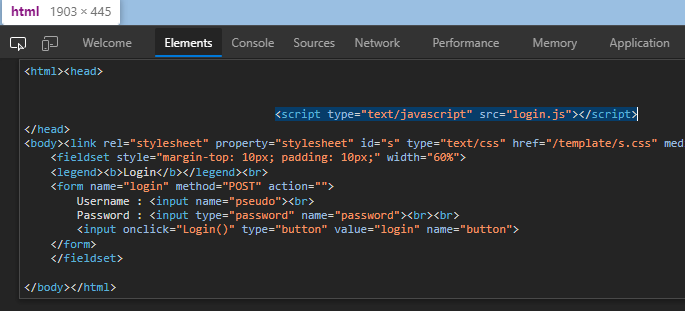

# Javascript - Authentication
## Người làm:   
    Nguyễn Ngọc Trưởng - 19522440
## Link: 
    https://www.root-me.org/en/Challenges/Web-Client/Javascript-Authentication
- Giao diện web mở đầu

- Đọc mã nguồn của trang web ta thấy ở head chèn mã javascript từ file `login.js`

- Kiểm tra file login.js (trong phần Network), ta thấy password được người dùng nhập vào được kiểm tra với "sh.org" và thông báo ra màn hình. password này cũng là password cần tìm của challenge.

## Password là `sh.org`