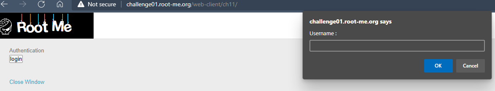
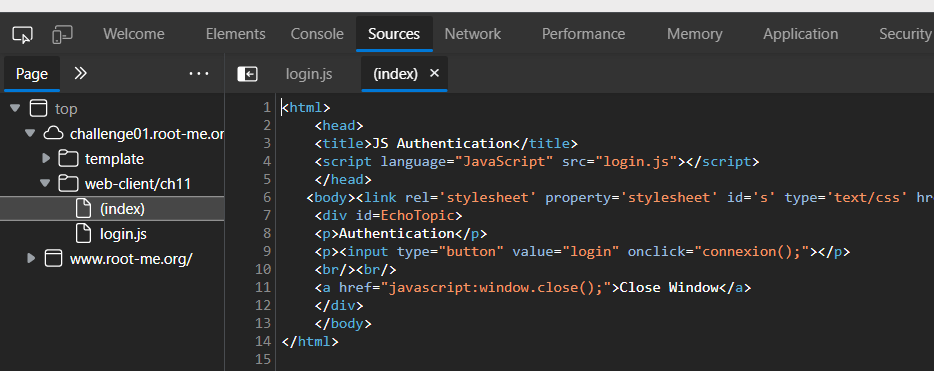
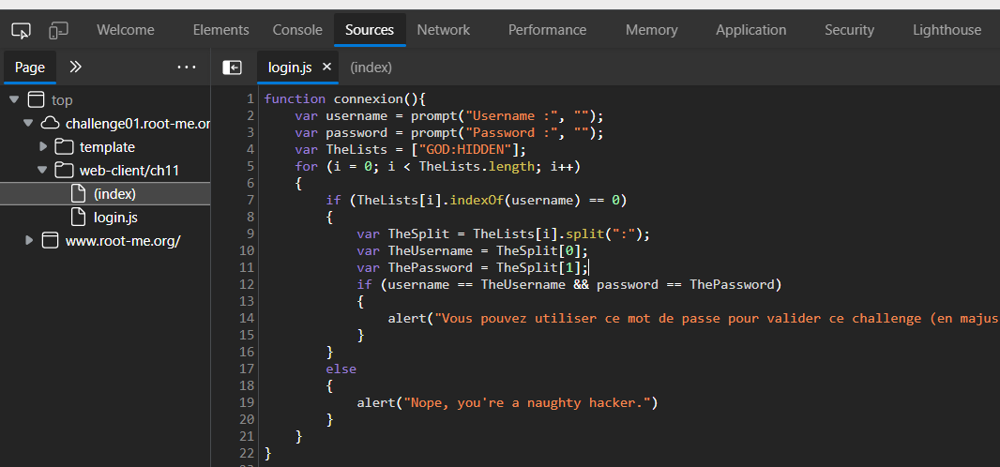

# Javascript - Authentication 2
## Người làm:   
    Nguyễn Ngọc Trưởng - 19522440
## Link: 
    https://www.root-me.org/en/Challenges/Web-Client/Javascript-Authentication-2
- Giao diện web mở đầu, khi ta nhấn vào nút login thì hiển thị thông báo điền username, password.

- Ta kiểm tra mã nguồn, ta thấy được trang tải mã javascript từ file login.js

- Tiếp tục kiểm tra file login.js

từ đây ta thấy username và password được kiểm tra với TheUsername và ThePassword. password được người dùng nhập cũng là password của challenge này. 
password = ThePassword = "GOD:HIDDEN".split(":")[1] = "HIDDEN" 

## Password là `HIDDEN`