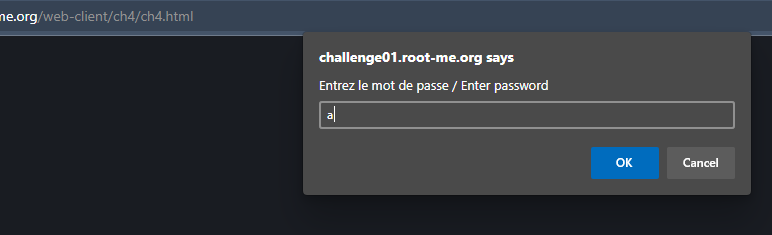
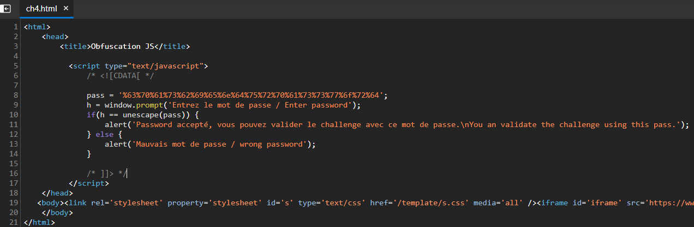
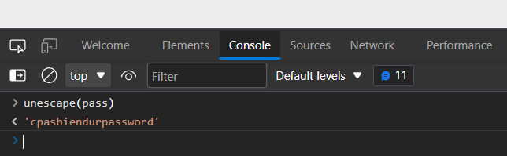

# Javascript - Obfuscation 1
## Người làm:   
    Nguyễn Ngọc Trưởng - 19522440
## Link:
    https://www.root-me.org/en/Challenges/Web-Client/Javascript-Obfuscation-1
- Giao diện web mở đầu, yêu cầu ta nhập password.

- nhập kí tự bất kì để bỏ qua bước này, và kiểm tra mã nguồn

- Ta thấy password nhập vào lưu vào biến h, sau đó kiểm tra với unescape(pass), và thông báo ra màn hình kết quả. Password này cũng là password của challenge. do vậy `password = unescape(pass)` mở Console để kiểm tra giá trị của unescape(pass)

## Password là `cpasbiendurpassword`