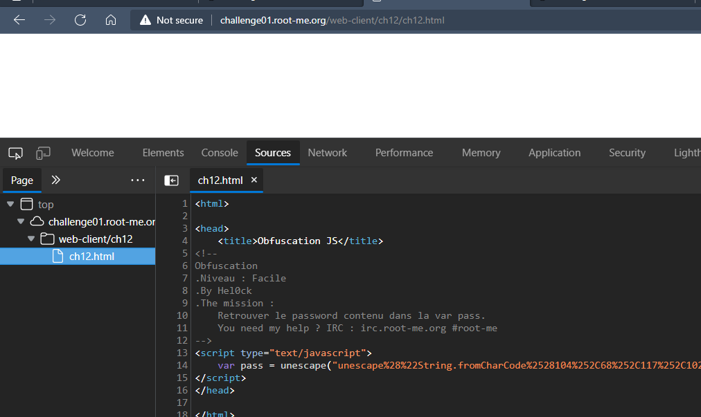
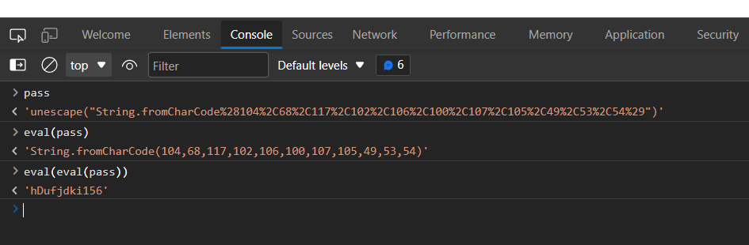

# Javascript - Obfuscation 1
## Người làm:   
    Nguyễn Ngọc Trưởng - 19522440
## Link:
    https://www.root-me.org/en/Challenges/Web-Client/Javascript-Obfuscation-2
- Giao diện web ban đầu là trang trắng, do vậy ta trực tiếp kiểm tra mã nguồn, ta thấy trong thẻ javascript, pass được gán bằng unescape("...") do vậy ta sẽ sử dụng Console để kiểm tra.

- ta thấy biến pass bằng chuỗi gì đó, và chuỗi này là một câu lệnh js khác, do vậy ta sẽ dùng hàm eval để thực hiện lệnh có trong chuỗi này. Ta vẫn thấy xuất hiện 1 chuỗi lệnh khác ta tiếp tục dùng eval. Kết quả cho 1 chuỗi kí tự, đây là password của challenge cần tìm.

## Password là `hDufjdki156`