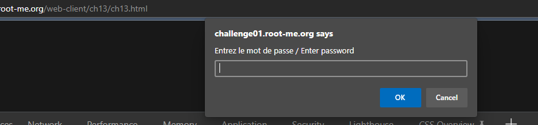
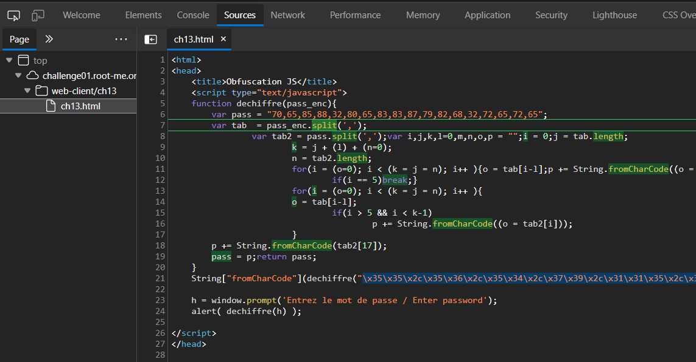
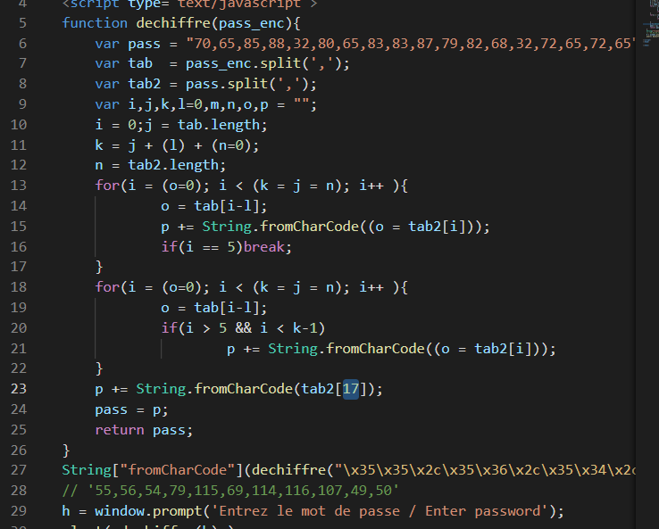
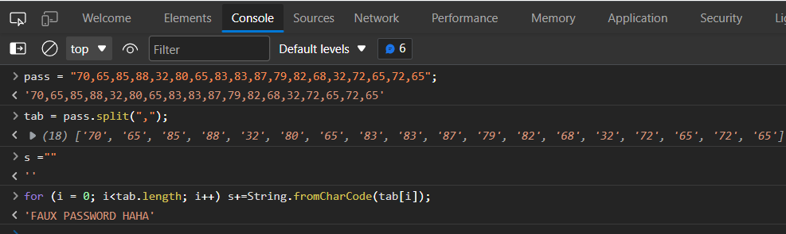
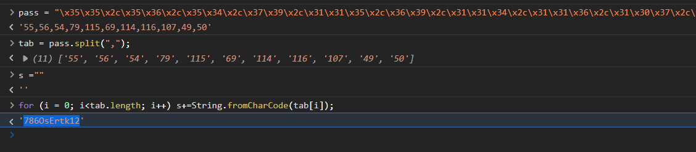

# Javascript - Native code
## Người làm:   
    Nguyễn Ngọc Trưởng - 19522440
## Link:
    https://www.root-me.org/en/Challenges/Web-Client/Javascript-Native-code
- Giao diện web ban đầu yêu cầu ta nhập password và thực hiện kiểm tra sau đó thông báo kết quả.
<p align="center"></p>
- Đọc source code để hiểu hơn về chương trình
<p align="center"></p>
- Trước hết ta cần chỉnh sửa đoạn code cho dễ nhìn
<p align="center"></p>

```
var i,j,k,l=0,m,n,o,p = "";
i = 0;j = tab.length;
k = j + (l) + (n=0);
n = tab2.length;
for(i = (o=0); i < (k = j = n); i++ ){
        o = tab[i-l];
        p += String.fromCharCode((o = tab2[i]));
        if(i == 5)break;
}
for(i = (o=0); i < (k = j = n); i++ ){
        o = tab[i-l]; 
        if(i > 5 && i < k-1)
                p += String.fromCharCode((o = tab2[i]));
}
p += String.fromCharCode(tab2[17]);
```

- Hiểu sơ về đoạn code trên ta thấy vai trò của 2 vòng for được biểu diễn:
```
p="";
for (i = 0; i< tab2.length; i++)
    p += String.fromCharCode(tab2[i])
```
- Kiểm tra chuỗi pass, ta thấy kết quả trả về giống như thông báo của chương trình khi nhập 1 chuỗi bất kỳ.
<p align="center"></p>

- Như vậy, dù nhập gì thì chương trình sẽ ra cùng 1 thông báo `FAUX PASSWORD HAHA` (output của hàm `dechiffre()`) như vậy password sẽ nằm ở 1 chỗ khác, ta thấy chuỗi hex, khi run thì cũng ra chuỗi tương tự với pass. Ta thực hiện lại chức năng của hàm dechiffre() thì có thể thu được password cần tìm
<p align="center"></p>

## Password là `786OsErtk12`
## Thời gian hoàn thành challenge: 40 phút