# Javascript - Obfuscation 4
## Người làm:   
    Nguyễn Ngọc Trưởng - 19522440
## Link:
    https://www.root-me.org/en/Challenges/Web-Client/Javascript-Native-code
- Giao diện web ban đầu yêu cầu chúng ta nhập password, nhập sai thì hiển thị thông báo thất bại.
<p align="center"></p>

- Để hiểu rõ hơn ta cần phải đọc source code của web
<p align="center">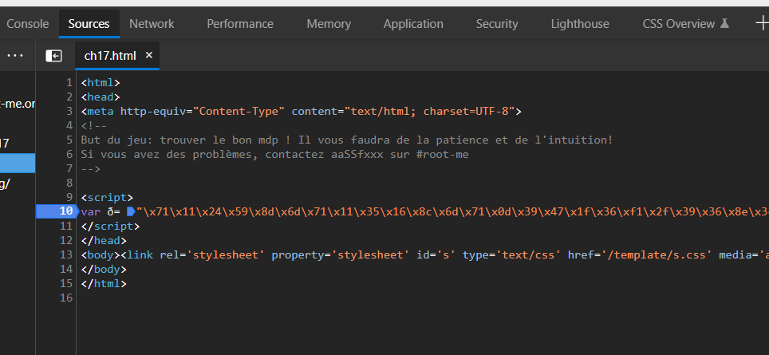</p>

- Trong thẻ `<script>`, ta thu thập được đoạn code, đoạn code được trình bày trên 1 dòng, vì thế rất khó khăn trong việc đọc hiểu code. Để tìm được pass ta cần hiểu cơ bản về đoạn script này, ta cần định dạng lại code.
```
<script>
    var ð= "\x71\x11\x24\x59\x8d\x6d\x71\x11\x35\x16\x8c\x6d\x71\x0d\x39\x47\x1f\x36\xf1\x2f\x39\x36\x8e\x3c\x4b\x39\x35\x12\x87\x7c\xa3\x10\x74\x58\x16\xc7\x71\x56\x68\x51\x2c\x8c\x73\x45\x32\x5b\x8c\x2a\xf1\x2f\x3f\x57\x6e\x04\x3d\x16\x75\x67\x16\x4f\x6d\x1c\x6e\x40\x01\x36\x93\x59\x33\x56\x04\x3e\x7b\x3a\x70\x50\x16\x04\x3d\x18\x73\x37\xac\x24\xe1\x56\x62\x5b\x8c\x2a\xf1\x45\x7f\x86\x07\x3e\x63\x47";
    function _(x,y){
        return x^y;
    }
    function __(y){
        var z = 0;
        for(var i=0;i<y;i++){z += Math.pow(2,i);}
        return z;
    }
    function ___(y){
        var z = 0;
        for(var i=8-y;i<8;i++){
            z += Math.pow(2,i);
        }
        return z
    } 
    function ____(x,y){
        y = y % 8;
        Ï = __(y);
        Ï = (x & Ï) << (8-y);
        return (Ï) + (x >> y);
    }
    function _____(x,y){
        y = y % 8;
        Ï = ___(y);
        Ï = (x & Ï) >> (8-y);
        return ((Ï) + (x << y)) & 0x00ff;
    }
    function ______(x,y){
        return _____(x,y)
    }
    function _______(_________,key){
        ________ = "";
        ________2 = "";
        for(var i=0;i<_________.length;i++){
            c = _________.charCodeAt(i);
            if(i != 0){
                t = ________.charCodeAt(i-1)%2;
                switch(t){
                    case 0:cr = _(c, key.charCodeAt(i % key.length));
                    break;
                    case 1:cr = ______(c, key.charCodeAt(i % key.length));
                    break;
                }
            }
            else{
                cr = _(c, key.charCodeAt(i % key.length));
            }
            ________ += String.fromCharCode(cr);
        }
        return ________;
    }
    function __________(þ){
        var ŋ=0;
        for(var i=0;i<þ.length;i++){
            ŋ+=þ["charCodeAt"](i)
        }
        if(ŋ==8932){
            var ç=window.open("","","\x77\x69\x64\x74\x68\x3d\x33\x30\x30\x2c\x68\x65\x69\x67\x68\x74\x3d\x32\x20\x30");
            ç.document.write(þ)
        }
        else{
            alert("Mauvais mot de passe!")
        }
    }
    __________(_______(ð,prompt("Mot de passe?")));
</script>
```

- Để thuận tiện và đơn giản hóa ta cần phải đặt lại tên của một số hàm và biến:
```
<script>
    var ð= "\x71\x11\x24\x59\x8d\x6d\x71\x11\x35\x16\x8c\x6d\x71\x0d\x39\x47\x1f\x36\xf1\x2f\x39\x36\x8e\x3c\x4b\x39\x35\x12\x87\x7c\xa3\x10\x74\x58\x16\xc7\x71\x56\x68\x51\x2c\x8c\x73\x45\x32\x5b\x8c\x2a\xf1\x2f\x3f\x57\x6e\x04\x3d\x16\x75\x67\x16\x4f\x6d\x1c\x6e\x40\x01\x36\x93\x59\x33\x56\x04\x3e\x7b\x3a\x70\x50\x16\x04\x3d\x18\x73\x37\xac\x24\xe1\x56\x62\x5b\x8c\x2a\xf1\x45\x7f\x86\x07\x3e\x63\x47";
    function Xor(x,y){
        return x^y;
    }
    function funcE(y){
        var z = 0;
        for(var i=0;i<y;i++){z += Math.pow(2,i);}
        return z;
    }
    function funcD(y){
        var z = 0;
        for(var i=8-y;i<8;i++){
            z += Math.pow(2,i);
        }
        return z
    } 
    function RightFunc(x,y){
        y = y % 8;
        Ï = funcE(y);
        Ï = (x & Ï) << (8-y);
        return (Ï) + (x >> y);
    }
    function LeftFunc(x,y){
        y = y % 8;
        Ï = funcD(y);
        Ï = (x & Ï) >> (8-y);
        return ((Ï) + (x << y)) & 0x00ff;
    }
    function funcA(x,y){
        return LeftFunc(x,y)
    }
    function MainFunc(arg1,key){
        item = "";
        // item2 = "";
        for(var i=0;i<arg1.length;i++){
            c = arg1.charCodeAt(i);
            if(i != 0){
                t = item.charCodeAt(i-1)%2;
                switch(t){
                    case 0:cr = Xor(c, key.charCodeAt(i % key.length));
                    break;
                    // case 1:cr = funcA(c, key.charCodeAt(i % key.length));
                    case 1:cr = LeftFunc(c, key.charCodeAt(i % key.length));
                    break;
                }
            }
            else{
                cr = Xor(c, key.charCodeAt(i % key.length));
            }
            item += String.fromCharCode(cr);
        }
        return item;
        // độ dài của item = độ dài của arg1 = độ dài chuỗi đã cho -->ð.length = 98
    }
    function CheckFunc(þ){
        var ŋ=0;
        for(var i=0;i<þ.length;i++){
            ŋ+=þ["charCodeAt"](i)
        }
        if(ŋ==8932){
            var ç=window.open("","","\x77\x69\x64\x74\x68\x3d\x33\x30\x30\x2c\x68\x65\x69\x67\x68\x74\x3d\x32\x20\x30");
            ç.document.write(þ)
        }
        else{
            alert("Mauvais mot de passe!")
        }
    }
    CheckFunc(MainFunc(ð,prompt("Mot de passe?")));
</script>
```
```
"\x77\x69\x64\x74\x68\x3d\x33\x30\x30\x2c\x68\x65\x69\x67\x68\x74\x3d\x32\x20\x30" = 'width=300,height=2 0'
```
- Xét trong toàn chương trình, ta phân tích chức năng của các hàm như sau:
    - hàm Xor(x,y): 
        ```
        input: số tự nhiên từ 0-255
        output: x xor y
        ```
    - hàm funcE(y):
        ```
        input: số tự nhiên từ 0-7
        output: tổng giá trị từ 2^0 --> 2^(y-1)
        ```
    - hàm funcD(y):
        ```
        input: số tự nhiên từ 0-7
        output: tổng giá trị từ 2^(8-y) --> 2^7
        ```
    - hàm RightFunc(x,y):
        ```
        input: số 2 số tự nhiên x, y từ 0-255
        output: xoay vòng bit của x sang phải y lần
        ví dụ: RightFunc(44,5) = 97
        ```
    - hàm LeftFunc(x,y):
        ```
        input: số 2 số tự nhiên x, y từ 0-255
        output: xoay vòng bit của x sang trái y lần
        ví dụ: RightFunc(44,5) = 97
        ```
    - hàm MainFunc(arg1,key):
        ```
        input: 
            arg1 = ð = var ð= "\x71\x11\x24\x59\x8d\x6d...."
            key: là chuỗi do người dùng nhập
        output:
            giá trị sau khi thực hiện mã hóa arg1 theo key
        ```
    - hàm CheckFunc(þ):
        ```
        input: chuỗi kí tự có độ dài bằng len(ð)
        output:
            Kiểm tra tổng giá trị mã ASCII của kí tự với 8932
            Nếu bằng thì tạo ra một cửa sổ mới và viết vào đó input
        ```
- Vì bài không cho output nên ta không có cách nào reverse để tìm key ta chỉ có thể thay đổi hướng tiếp cận.Đánh giá lại sau khi phân tích các hàm, chương trình có:
    - Input: 
        - là key - input của hàm MainFunc
        - do người dùng nhập vào --> mã ASCII từ 32 -> 126
    - Output: 
        - là input của hàm CheckFunc, cũng là output của hàm MainFunc
        - là input của `ç.document.write()` --> có thể đọc viết được --> mã ASCII từ 32 -> 126
        - document.write() có đầu vào là text hoặc là code html
        ```
        possible = ""
        for(var i=32; i<=126; i++) possible+=String.fromCharCode(i)

        <!-- possible = ' !"#$%&\'()*+,-./0123456789:;<=>?@ABCDEFGHIJKLMNOPQRSTUVWXYZ[\\]^_`abcdefghijklmnopqrstuvwxyz{|}~' -->
        ```
- Đến đây ta sẽ bruteforce, vì không biết key sẽ phải có bao nhiêu ký tự mới thỏa mãn nên ta lần lượt quét kí tự để ra output là kí tự có mã ASCII từ 32 -> 126
 
```
m = ""
for(var i=0; i<possible.length; i++){
    X = MainFunc(ð, possible[i]);
    if (X["charCodeAt"](0)<=126 && X["charCodeAt"](0)>=32) m+=possible[i];
}
<!-- m = ` !"#$%&'()*+,-./0123456789:;<=>?@ABCDEFGHIJKLMNOPQRSTUVWXYZ[\\]^_` -->
```
- Giả sử key có ít hơn 10 kí tự, và khi đó ta có các giá trị phù hợp của key phù hợp như hình bên dưới, thử tính toán nếu giả sử có key có đúng 10 kí tự, khi đó số lượng vòng lặp sẽ là `104936117907750910`.
```
m = ["","","","","","","","","",""]
s = ""
for (var n = 0; n<10; n++){
    if (n>0) s+=m[n-1][0];
    for(var i=0; i<possible.length; i++){
        X = MainFunc(ð,s+ possible[i]);
        if (X["charCodeAt"](n)<=126 && X["charCodeAt"](n)>=32) m[n]+=possible[i];
    }
}
```
<p align="center">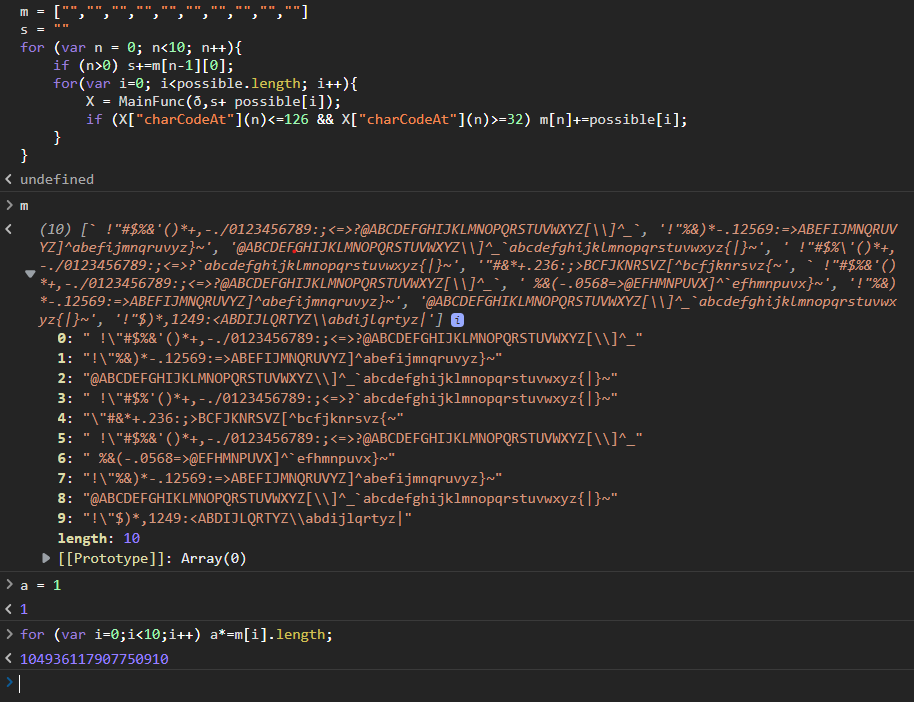</p>

- Ta cần Chỉnh sửa lại hàm CheckFunc() để có thể sử dụng kiểm tra lần lượt số lượng số kí tự key có thể có. 

```
function CheckFunc(þ){
    var ŋ=0;
    for(var i=0;i<þ.length;i++){
        if (þ["charCodeAt"](i) > 126 || þ["charCodeAt"](i) <32 ) return false;
        ŋ+=þ["charCodeAt"](i)
    }
    if(ŋ==8932) return true;
    return false;
}
```
- Sau khi thử với độ dài bằng 1, 2, 3 thì ta biết chắn chắn rằng key có độ dài > 3, nếu thử nhiều hơn tức với độ dài = 4 thì sẽ không chạy nổi
<p align="center">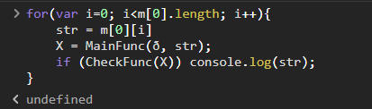</p>

<p align="center">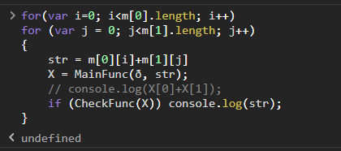</p>

<p align="center">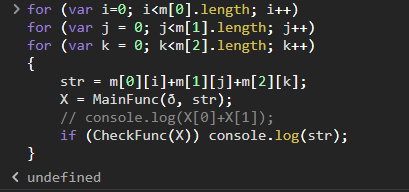</p>
- Ta cần chắn chắn được những giá trị ở vị trí đầu trước khi tiếp tục!!!

```
    Giải pháp!!!
    - ta sẽ xét từng trường hợp, giả sử độ dài bằng 4,5,6,7,8,9,10...
    - cần xác định chính xác được giá trị của những vị trí đầu tiên.
    - Do đó ta có thể dùng cách thử, và đếm những số kí tự được mã hóa thành công tại các vị trí có phần dư nhỏ hơn 2, 3, như hàm bên dưới:
    
    function CountChar(str,n,x){
    tmp = 0;
    for(var i=0;i<str.length;i++)
        if (i%n <x) 
            if (str["charCodeAt"](i) <= 126 && str["charCodeAt"](i) >= 32 ) 
                tmp+=1;
    return tmp;
    }
```

```
arrA1 = []
arrA2 = []
arrB = []
for (var i=0; i<m[0].length; i++)
for (var j = 0; j<m[1].length; j++)
{
    str = m[0][i]+m[1][j]+"AA";
    X = MainFunc(ð, str);
    arrA1.push(m[0][i]+m[1][j]);
    arrA2.push(X[0]+X[1]);
    arrB.push(CountChar(X,str.length,2));
}
```

### Giải pháp bị bất khả thi vì, hàm MainFunc() không mã hóa độc lập theo từng kí tự. Mà kí tự đang mã hóa bị ảnh hưỡng bỡi kí tự ở trước nó, `item.charCodeAt(i-1)%2`, Do vậy ta cần phải thay đổi hướng, xem xét đến khả năng input của hàm `document.write() là mã html`
- Khi đó 2 kí tự đầu tiên là `<_` trong đó `_` là 1 chữ cái in thường hoặc in hoa. Kí tự đầu tiên không bị ảnh hưởng bỡi ` nút thăt  ` ở giải pháp trước, nên kí tự đầu tiên là `M`.
<p align="center">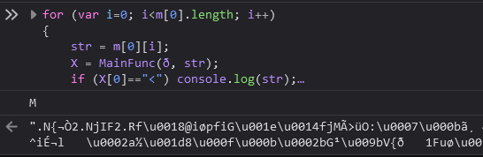</p>

- vì key > 3 kí tự, nên ta tìm ra các bộ chữ cái thỏa mãn ngôn ngữ tự nhiên
<p align="center">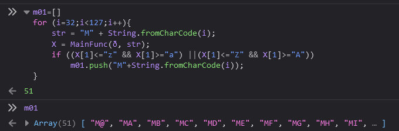</p>
<p align="center">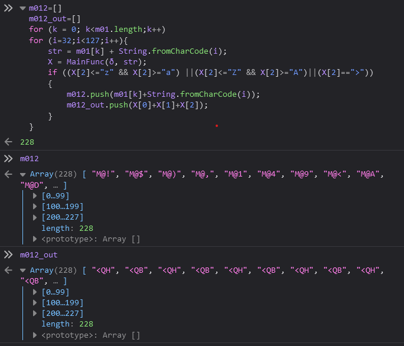</p>

- Mà 3 kí tự này là một thẻ của ngôn ngữ html, nên trước hết chúng ta cần kiếm danh sách các mã của ngôn ngữ html. Để lấy các tất cả các thẻ có thể có ta dùng đoạn code python:
```    
import requests
from bs4 import BeautifulSoup
url = "https://www.w3schools.com/TAgs/default.asp"
header = {"user-agent": "Mozilla/5.0",}
response = requests.get(url,headers=header)
soup = BeautifulSoup(response.content, "html.parser")

if response.status_code == 200:
    table = soup.find('table', class_='ws-table-all notranslate')
    lstItem = table.findAll('tr')
    lst=[]
    for item in lstItem:
        if item.find('a'):
            lst.append(item.find('a').text)
    print(lst)
```

- Vì tạm xét ở 3 kí tự, nên ta sẽ lấy 3 kí tự đầu của danh sách các thẻ. từ đó giảm đáng kể số lượng khả năng 3 kí tự đầu tiên của key. từ 228 xuống 130
<p align="center">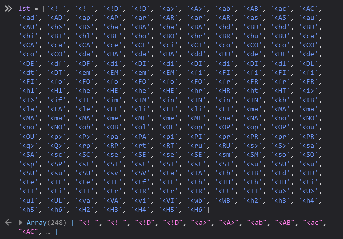</p>
<p align="center">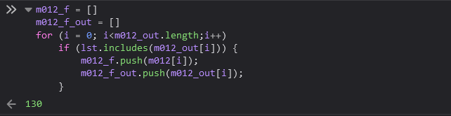</p>

- Tương tự, đối xét đến 4 kí tự: giảm từ 12350 trường hợp xuống 70 trường hợp thỏa mãn
<p align="center">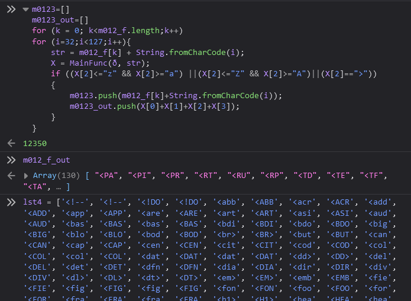</p>
<p align="center">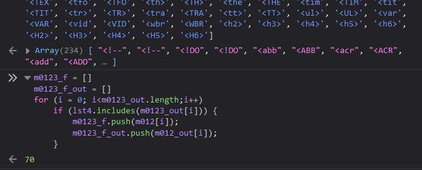</p>

thông qua hàm kiểm tra, ta biết độ dài của key cũng không phải là 4 kí tự nên ta cần xét tiếp.
<p align="center">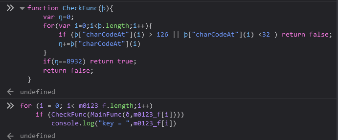</p>
<p align="center">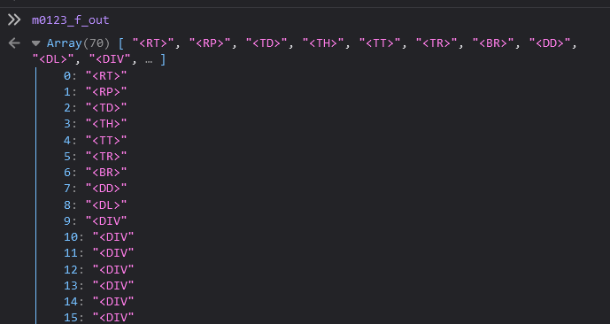</p>

- Đánh giá về thẻ tạo ra, thì ta thấy hầu hết thẻ có 4 kí tự đều là thẻ liên quan đến danh sách và bảng, do vậy mạnh dạng bỏ qua. Xét tiếp với những thẻ còn chưa đầy đủ. Do vậy kí tự thứ 5 cũng cần phải góp phần hoàn thiện chuỗi còn đang chưa có dấu ">"
- Xét đến kí tự thứ 5, số trường hợp còn lại là 180 trường hợp, tuy nhiên, duyệt qua các khả năng này thì key cũng không phù hợp. DO Vậy key nhiều hơn 5 kí tự
<p align="center">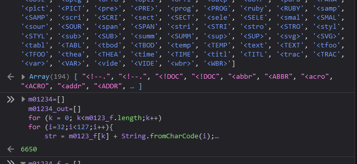</p>
<p align="center">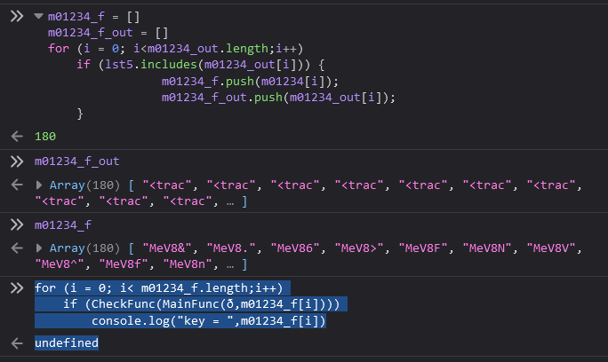</p>

- Nhìn kết quả output: ta thấy được các thẻ đầu tiên chỉ thuộc 4 trường hợp: 
    ```
    <blockquote>
    <track>
    <fieldset>
    <html>
    ```
- Tương tự đến kí tự thứ 6.
<p align="center">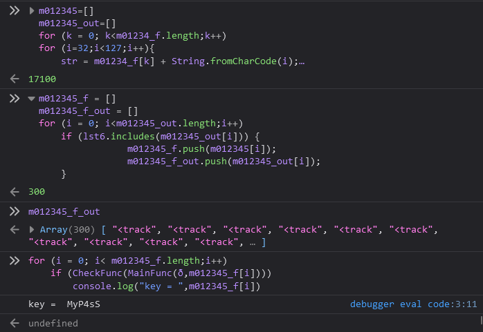</p>

- Đến đây sau khi kiểm tra ta thu được giá trị của key...
## Password là `MyP4sS`
## Thời gian hoàn thành challenge: ~ 24h