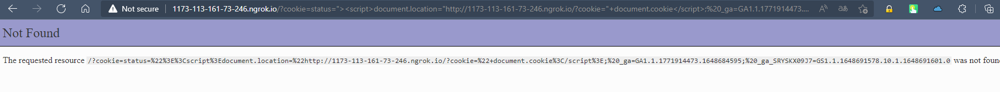

# Challenge: XSS - Stored 2
## Người làm:   
    Nguyễn Ngọc Trưởng - 19522440
    Thời gian: 120 phút
## Link: 
    https://www.root-me.org/en/Challenges/Web-Client/XSS-Stored-2

- Ta thử với các input kiểm tra có bị lỗi XSS cơ bản không

- Kiểm tra mã nguồn thì ta thấy những giá trị nhập vào đều được chuyển đổi các kí tự đặc biệt, do vậy ta có thể khai khác được lỗi XSS từ đây

- nhìn source code ta thấy 1 giá trị invite? trước thẻ html render ra input ta đã nhập, Kiểm tra kĩ thì ta thấy được rằng nó là giá trị của cookie status

- Thử với giá trị `status=<h1>Nguyen Ngoc Truong</h1>`, ta thấy giá trị của nó trong thuộc tính của thẻ i không bị chuyển đổi kí tự đặc biệt

- Ta tiến hành đóng thẻ i thử, khi đó thử với status=`"><h1>LAo Ngoc 2k1</h1>`, ta thấy nó có sự thay đổi về giao diện. thẻ h1 được render

- Vì mình cần lấy ra cookie do vậy ta thử với `">` lúc này ta nhận được thông báo.

- Thay đổi status `= ">`ta khi tải lại trang, ta thấy trang web của challenge tự chuyển hướng sang trang web của chúng ta.

- Chờ đợi và nhận Cookie của Admin

- Trong challenge có nó chúng ta cần truy cập với phiên admin, do vậy chúng ta thêm cookie đã lấy được và truy cập lại trang web, nhấn vào admin ta sẽ thấy được pass

## Kết quả flag là `E5HKEGyCXQVsYaehaqeJs0AfV`