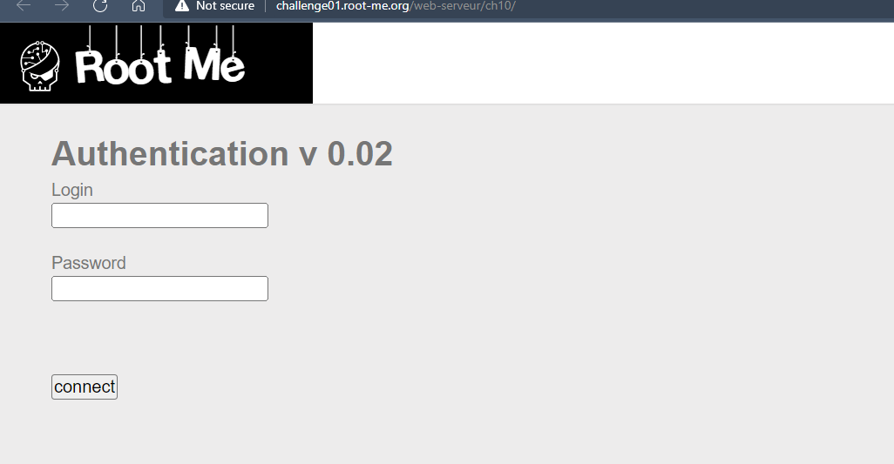
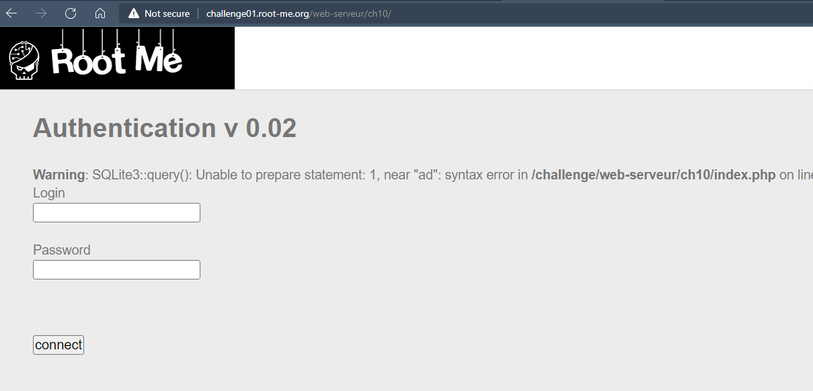
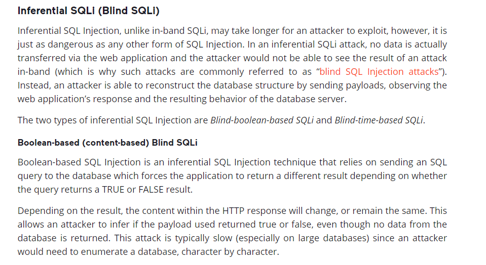
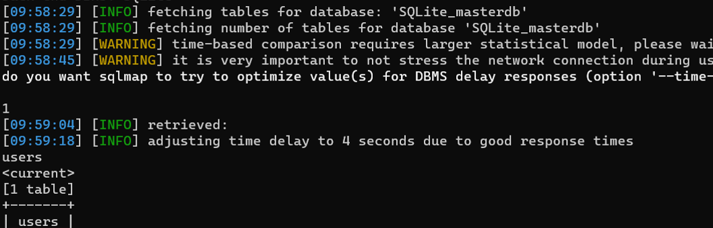
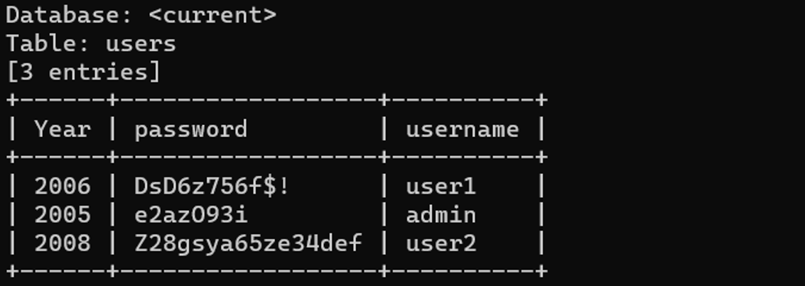

# Challenge: SQL injection - Blind
## Người làm:   
    Nguyễn Ngọc Trưởng - 19522440
    Thời gian: 
## Link: 
    https://www.root-me.org/en/Challenges/Web-Server/SQL-injection-blind

- Với thử thách này thì ta thấy chỉ có duy nhât một form đăng nhập.

- Ta thử đăng nhập và kiểm tra khai thác với lỗi sql injection thì ta thấy nó không có lỗi gì, đồng thời ta biết được csdl này đang dùng là sqlite3. Tìm kiếm thông tin lỗi SQL injection blind, ta thấy SQL Injection Blind có 2 loại là  Blind-boolean-based SQLi và Blind-time-based SQLi, có thể bài này là Blind-boolean-based SQLi (vì bài trước là Blind-time-based SQLi rồi)

https://www.acunetix.com/websitesecurity/sql-injection2/#:~:text=What%20is%20a%20time-based,query%20is%20true%20or%20false

- Ta sử dụng option --tables để hiển thị thông tin các bảng có trong cơ sở dữ liệu
>sqlmap -u "http://challenge01.root-me.org/web-serveur/ch10/" --tables 

- Hiển thị thông tin của bảng users:
>sqlmap -u "http://challenge01.root-me.org/web-serveur/ch10/" -T users --dump

## Kết quả password là `T!m3B@s3DSQL!`