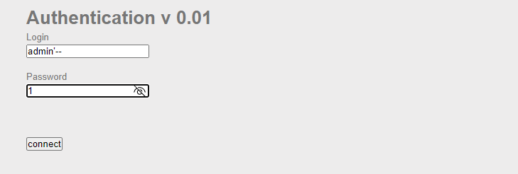
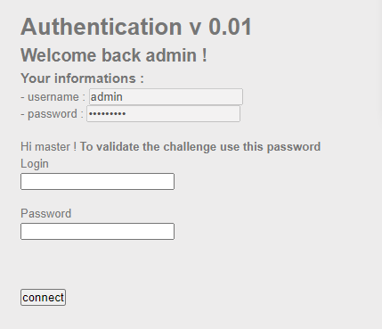
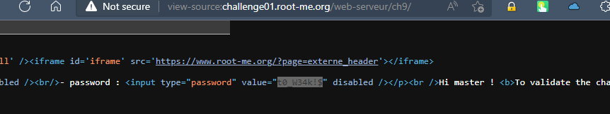

# Challenge: SQL injection - Authentication
## Người làm:   
    Nguyễn Ngọc Trưởng - 19522440
    Thời gian: 
## Link: 
    https://www.root-me.org/en/Challenges/Web-Server/SQL-injection-authentication

- Thử thách chỉ cho 1 yêu cầu là gởi một form đăng nhập, vì bài này là ta thử với input của trường login là `admin'--` và password là 1 chuỗi bất kì, ta nhập `1`... giá trị thử cơ bản của lỗi SQL injection

- Lúc này ta thấy ngay có một trường thông tin mới xuất hiện - thông tin đăng nhập của admin. Ta để ý thấy dòng chữ "To validate the challenge use this password"

- Ta tiến hành xem mã nguồn bằng cách nhấn Ctrl + U, khi đó ta được tìm thấy mật khẩu của admin.

## Kết quả password là `t0_W34k!$`