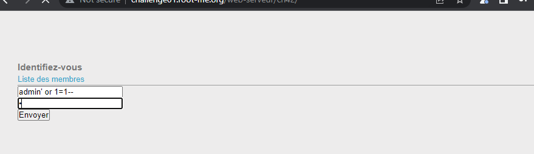
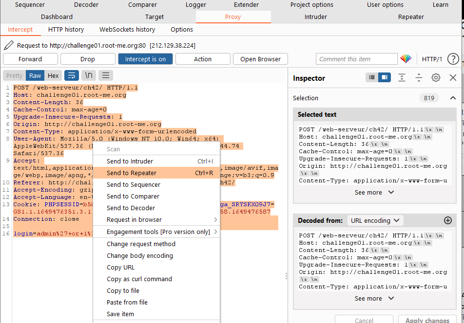
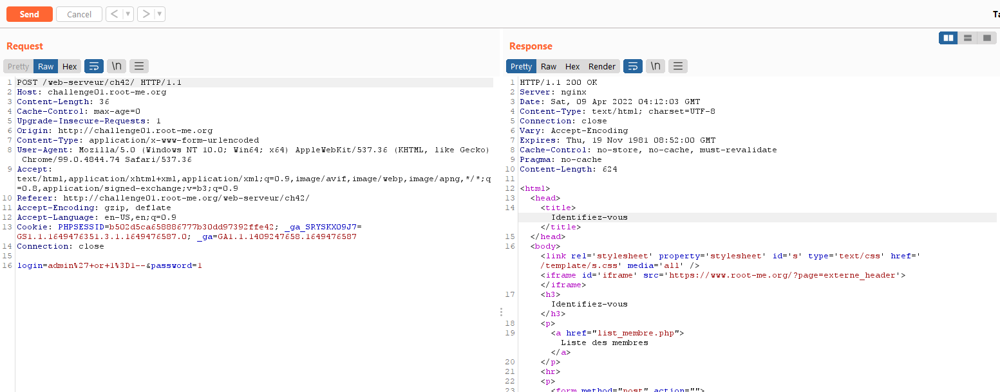
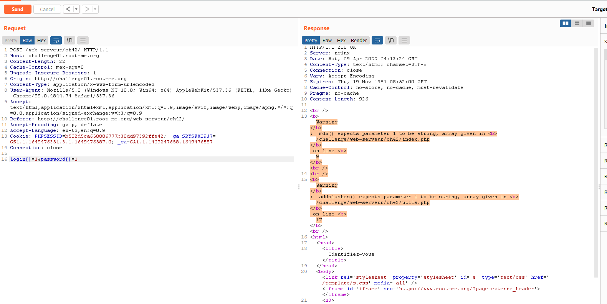
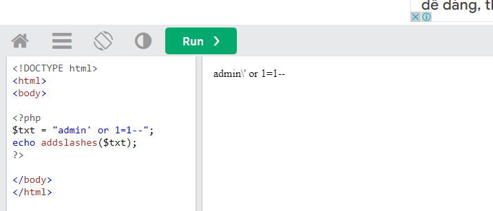
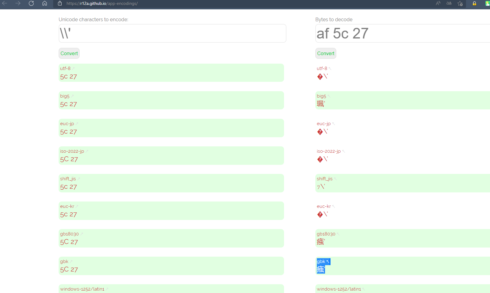
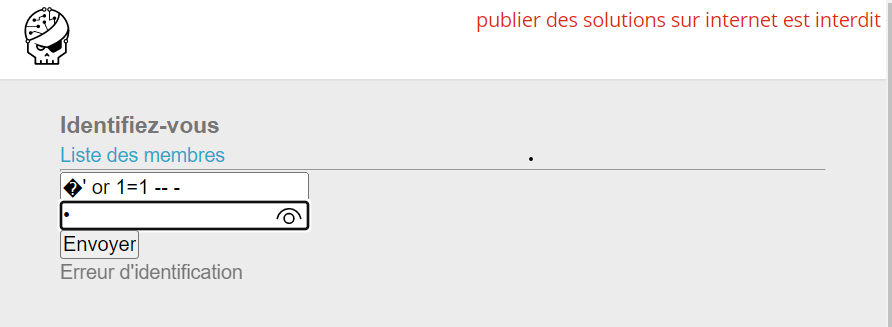
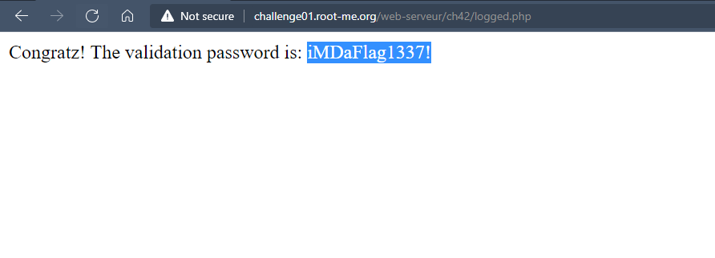

# Challenge: SQL injection - Authentication - GBK
## Người làm:   
    Nguyễn Ngọc Trưởng - 19522440
    Thời gian: 
## Link: 
    https://www.root-me.org/en/Challenges/Web-Server/SQL-injection-authentication-GBK

- Thử với các giá trị thường gặp của lỗi SQL injection, tuy nhiên ta thấy vẫn không xuất hiện gì

- Đến đây ta dùng burp suite để thuận tiện cho việc xử lý các input của request và xem được source code của response, ta dùng proxy can thiệp đến request.

- Để thuận tiện thì ta gởi nó qua Repeater

- Vì các giá trị cơ bản thường gặp của lỗi SQL injection thì ta thấy không có thông báo gì, chúng tha thử thay đổi biến nhập vào, sử nó thành dạng mảng. --> lúc này ta thấy có 2 thông báo lỗi, password sẽ được xử lý qua hàm md5(), còn login thì được xử lý qua hàm addslashes()

- Do đó ta sẽ cần bypass hàm addslashes() để có thể vượt qua login, password thì chỉ cần comment lại là được
- Tìm hiểu về GBK ta biết được đây là bộ kí tự Unicode 1.1 gồm tất cả các kí tự Trung Quốc
https://en.wikipedia.org/wiki/GBK_(character_encoding)

- Dùng chương trình online để compiler PHP để xem hàm addslashes() làm gì, ta thử với giá trị `admin' or 1=1--` ta thấy kí tự `'` đã được thêm trở thành `\'`

- Ý tưởng mà để bypass hàm addslashes này là gì? Ta sẽ chèn 1 kí tự hay 1 đoạn kí tự vào nào đó để nó kết hợp với kí tự \ thì nó sẽ cho ra một kí Trung Quốc GBK...
- Ta thấy `\' = 5c 27 `, 1 kí tự GBK khác `痋' = af 5c 27`
    
    https://r12a.github.io/app-encodings/

- Như vậy thông tin mà ta attack sql injection sẽ là `�' or 1=1 -- -` `-- -` là kiểm comment của mysql để bỏ qua mật khẩu, khi qua sử lý của hàm addslashes() thì nó sẽ thành  `�\' or 1=1 -- -` dạng utf-8 ==> ở dạng GBK là `痋' or 1=1 -- -`, password ta sẽ nhập gì đó tùy ý.

- Kết quả

## Kết quả password là `iMDaFlag1337!`