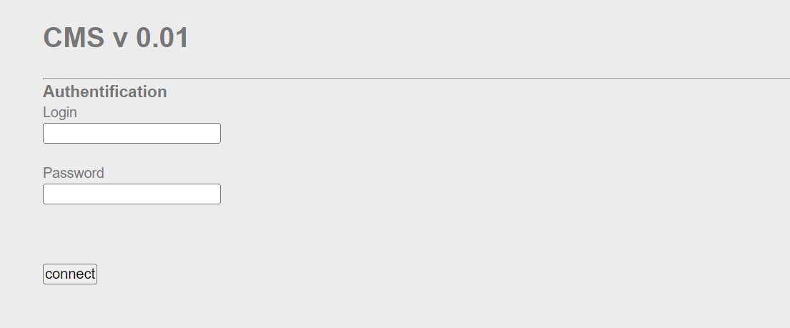
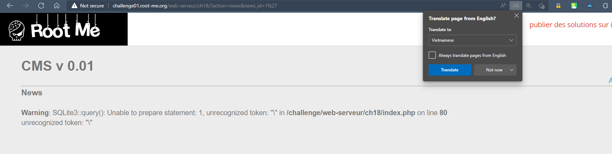
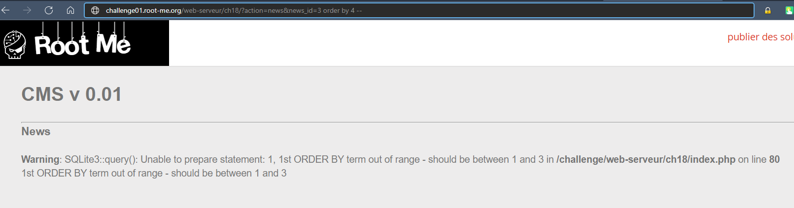
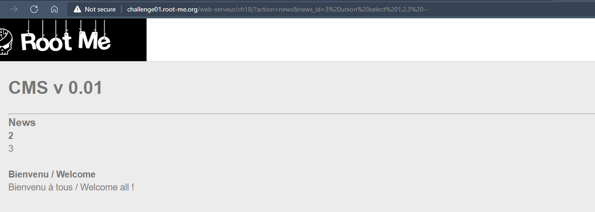
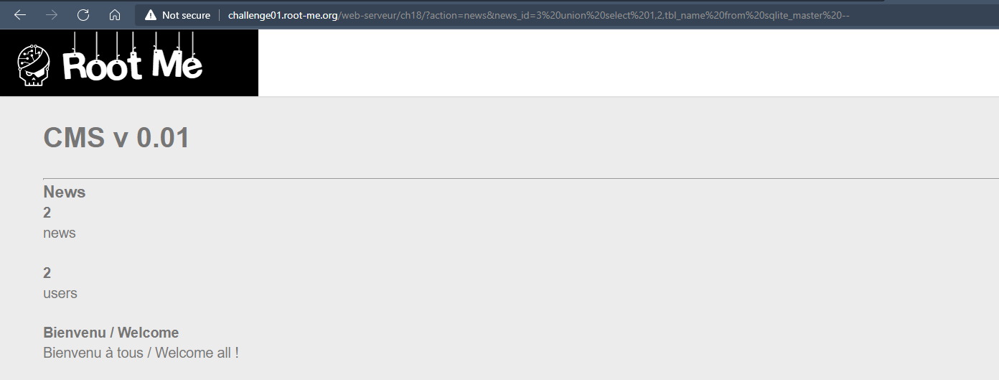
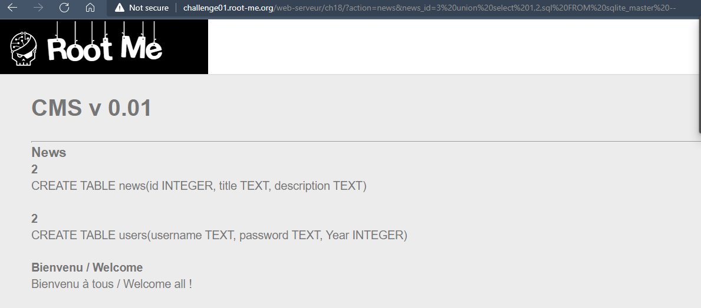
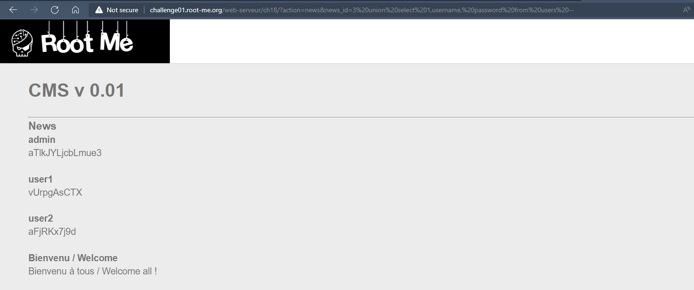

# Challenge: SQL injection - Numeric
## Người làm:   
    Nguyễn Ngọc Trưởng - 19522440
    Thời gian: 
## Link: 
    https://www.root-me.org/en/Challenges/Web-Server/SQL-injection-Numeric

- So với bài trước thì bài này chỉ có 1 form đăng nhập, và vẫn có phần truy vẫn các bài viết trên đường link.

- Giống như bài trước, thì đề vẫn yêu cầu ta password của admin, thử với các lỗi cơ bản ở form này như bài trước, tuy nhiên vẫn không khai thác được gì.
Có lẽ bí? Tin trưởng sẽ giống bài trước, ta thử truy vấn bằng đường link, thêm kí tự `'` vào đường link xuất ra các bài viết thử xem có bị lỗi kết nối union như bài trước hay không.

--> thật sự nó đã bị lỗi giống bài trước

- Kiểm tra số lượng cột hiển thị ra màn hình tối đa, chèn thêm `order by 4 --` ta biết được số cột hiển thị tối đa là 3

- Thử với `union select 1,2,3 --` để xem các cột hiển thị trên trình duyệt

- Thử với ` union select 1,2,tbl_name from sqlite_master -- ` như bài trước ta nhận được 2 bảng đó là news,users

- Thử với ` union select 1,2,sql FROM sqlite_master --`  để show ra các cột có trong bảng các bảng

- Lấy username password bằng cách chèn vào ` union select 1,username, password from users -- ` giống như bài trước

- Lấy password của admin submit, và vượt qua thử thách 

> Bài này có vẻ khá giống bài trước đó SQL-injection-String, chỉ khác nhau là bài này không cần dấu đóng chuỗi ):
## Kết quả password là `aTlkJYLjcbLmue3`
