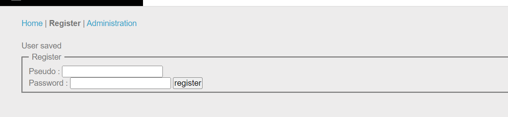
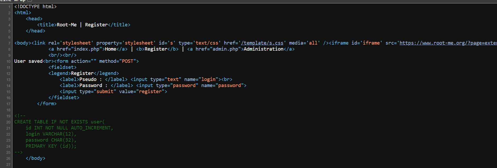
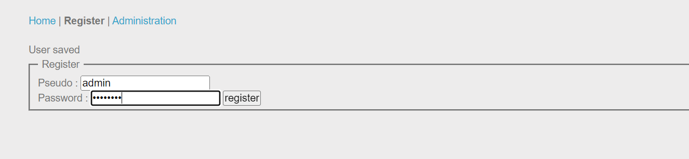

# Challenge: SQL Truncation
## Người làm:   
    Nguyễn Ngọc Trưởng - 19522440
    Thời gian: 
## Link: 
    https://www.root-me.org/en/Challenges/Web-Server/SQL-Truncation

- Bài này cơ bản có 2 form 1 là form đăng ký tài khoản, 2 là form nhập password để vào tài khoản admin
<p align="center"></p>

- Có vẻ như nhiệm vụ của chúng ta là cần phải đăng nhập vào tài khoản admin, do vậy ta sẽ khai thác lỗi gì đó ở form đăng ký. Thử tạo tài khoản đăng ký, ta thấy bình thường chả có gì!... có thể dừng lại ở đây.
- Thử kiểm tra mã nguồn, ta thấy có đoạn code sql khai báo cấu trúc của bảng user
<p align="center"></p>

- Vẫn chưa đủ để làm gì cả, tìm hiểu về Truncation SQL xem có gì mới không... được lắm `Lỗ hổng SQL Truncation xảy ra khi cơ sở dữ liệu cắt đứt đầu vào của người dùng do hạn chế về độ dài. `
https://linuxhint.com/sql-truncation-attack/

- Vào việc và đăng ký tài khoản với 
```
username = 'admin____________________________123'
password = 'abcdefgh'
```
<p align="center"></p>

- Ta sẽ nhận được thông báo đăng ký thành công, ta vào trang Administration để nhập password vừa tạo, khi đó ta sẽ nhận được flag
<p align="center"></p>

## Kết quả password là `J41m3Qu4nD54Tr0nc`