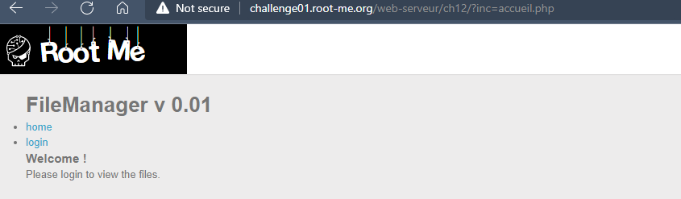
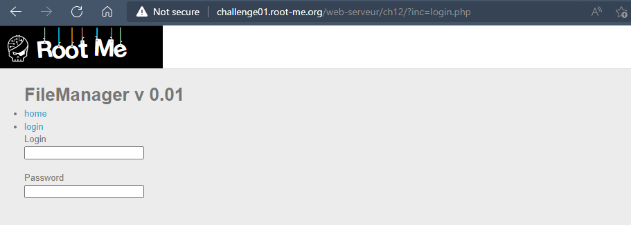
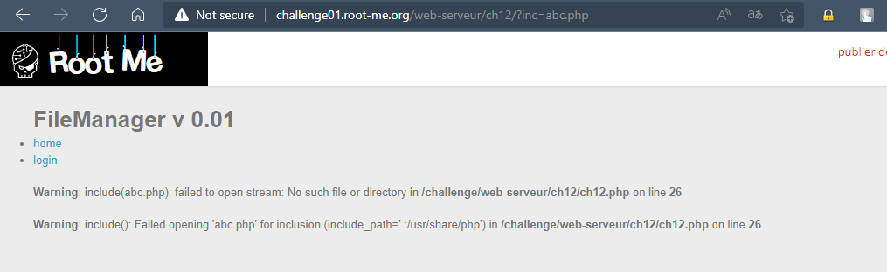
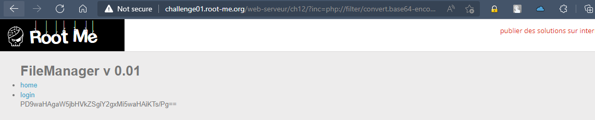
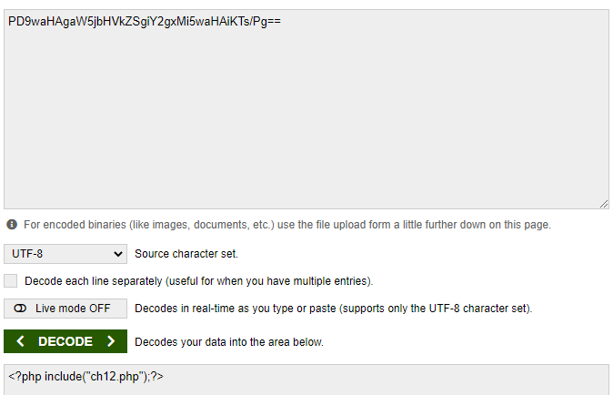
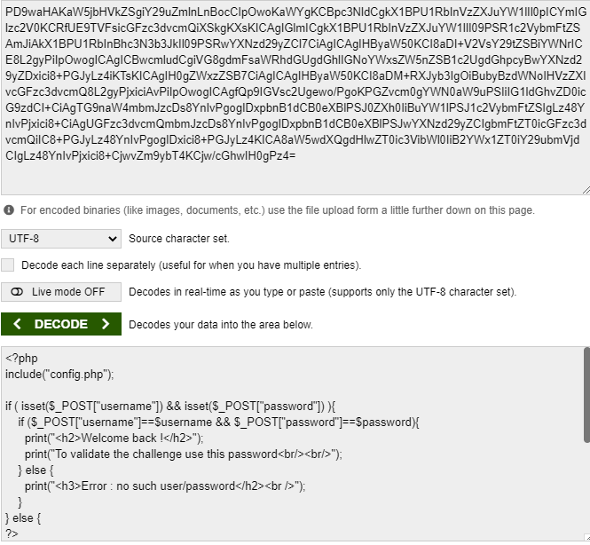

# Challenge: PHP - Filters
## Người làm:   
    Nguyễn Ngọc Trưởng - 19522440
    Thời gian:
## Link: 
    https://www.root-me.org/en/Challenges/Web-Server/PHP-Filters

- Thử thách cho chúng ta 1 trang login, 1 trang home được truyền vào tham số `inc` của request get.
<p align="center"></p>
<p align="center"></p>

- Thử với `page=abc.php` --> ta thấy Warning. ta biết rằng input sẽ được truyền vào hàm include(). 
<p align="center"></p>

- Ta cần xem nội dung của các tệp tin php này, ta thử dùng  php://filter như bài 2 để có thể xem mã nguồn của file `php://filter/convert.base64-encode/resource=index.php`
https://medium.com/@nyomanpradipta120/local-file-inclusion-vulnerability-cfd9e62d12cb

<p align="center"></p>

- Ta thấy kết quả được hiển thị, như vậy sau khi giải mã base64 ta sẽ có nội dung của file index.php
<p align="center"></p>

- Ta xem tiếp file `login.php`, `php://filter/convert.base64-encode/resource=login.php`
<p align="center"></p>

- Nội dung trong file login sẽ thực hiện kiểm tra password và username nhập vào với $password và $username, vì ở trên không khai báo nên nó trong file config.php được include vào 

- Ta tiến hành xem nội dung của config.php
> http://challenge01.root-me.org/web-serveur/ch12/?inc=php://filter/convert.base64-encode/resource=config.php

- Sau khi decode-base64 ta được 
```
<?php
$username="admin";
$password="DAPt9D2mky0APAF";
```

## Kết quả password là `DAPt9D2mky0APAF`