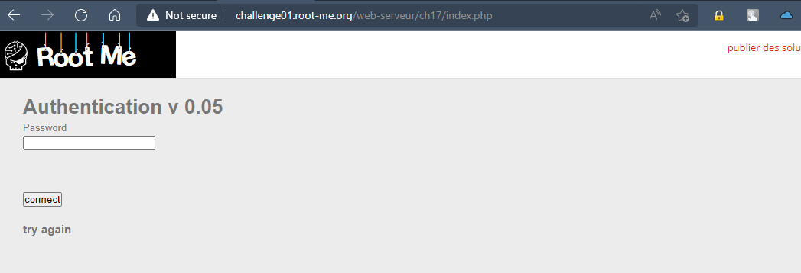
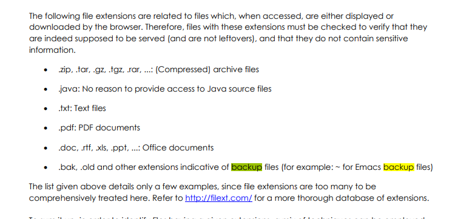
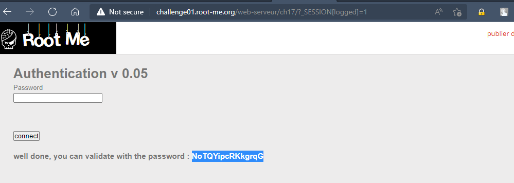

# Challenge: PHP - register globals
## Người làm:   
    Nguyễn Ngọc Trưởng - 19522440
    Thời gian:
## Link: 
    https://www.root-me.org/en/Challenges/Web-Server/PHP-register-globals

- Thử thách chỉ cho ta 1 trang nhập mật khẩu duy nhất, ta thử kiểm tra tài mã nguồn thì cũng không có gì để khai thác 
<p align="center"></p>

- Đề có gợi ý cho ta, lập trình viên có để lại file backup, ta thử tìm kiếm trong tài liệu đã cung câp ta thấy file backup có phần mở rộng là .bak hoặc .old
<p align="center"></p>

- Đề chỉ cho ta 1 trang index.php (trang chủ). do vậy ta thử với các giá trị của filename, ta thấy file backup có filename là `index.php.bak`
```
<?php


function auth($password, $hidden_password){
    $res=0;
    if (isset($password) && $password!=""){
        if ( $password == $hidden_password ){
            $res=1;
        }
    }
    $_SESSION["logged"]=$res;
    return $res;
}


function display($res){
    $aff= '
	  <html>
	  <head>
	  </head>
	  <body>
	    <h1>Authentication v 0.05</h1>
	    <form action="" method="POST">
	      Password&nbsp;<br/>
	      <input type="password" name="password" /><br/><br/>
	      <br/><br/>
	      <input type="submit" value="connect" /><br/><br/>
	    </form>
	    <h3>'.htmlentities($res).'</h3>
	  </body>
	  </html>';
    return $aff;
}


session_start();
if ( ! isset($_SESSION["logged"]) )
    $_SESSION["logged"]=0;

$aff="";
include("config.inc.php");

if (isset($_POST["password"]))
    $password = $_POST["password"];

if (!ini_get('register_globals')) {
    $superglobals = array($_SERVER, $_ENV,$_FILES, $_COOKIE, $_POST, $_GET);
    if (isset($_SESSION)) {
        array_unshift($superglobals, $_SESSION);
    }
    foreach ($superglobals as $superglobal) {
        extract($superglobal, 0 );
    }
}

if (( isset ($password) && $password!="" && auth($password,$hidden_password)==1) || (is_array($_SESSION) && $_SESSION["logged"]==1 ) ){
    $aff=display("well done, you can validate with the password : $hidden_password");
} else {
    $aff=display("try again");
}

echo $aff;

?>
```

- Ta thấy server kiểm tra trạng thái đăng nhập bỡi ` $_SESSION["logged"]==1 `. Bài này là `register globals` do vậy ta sẽ exploit nó bởi GET request với `?_SESSION[logged]=1`?
> http://challenge01.root-me.org/web-serveur/ch17?_SESSION[logged]=1

<p align="center"></p>

## Kết quả password là `NoTQYipcRKkgrqG`