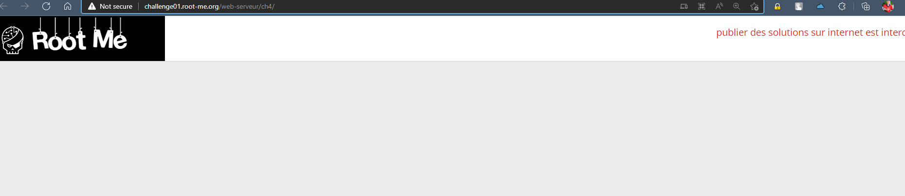

# Challenge: HTTP - Directory indexing
## Người làm:   
    Nguyễn Ngọc Trưởng - 19522440
    Thời gian:
## Link: 
    https://www.root-me.org/en/Challenges/Web-Server/HTTP-Directory-indexing

- Thử thách cho chúng ta 1 trang render ra "trắng tinh" do vậy thử xem source code 

- Ta thấy có comment `<!-- include("admin/pass.html") -->` Do vậy ta thử truy cập vào trang /admin/pass.html, vì trang cũng không hiển thị pass nên ta cũng cần xem source code

- Không có gì được ẩn giấu trong source code thì nên ta thử chỉ truy cập /admin/, ta thấy trang này như một cây thư mục 

- Trong thư mục backup có chứa file admin.txt, ta thấy password được hiển thị ở đây

## Kết quả password là `LINUX`