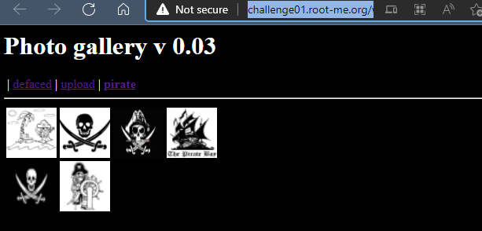
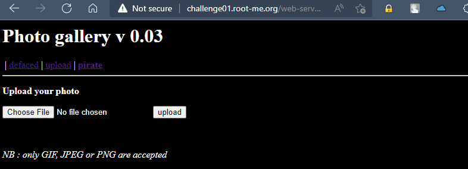
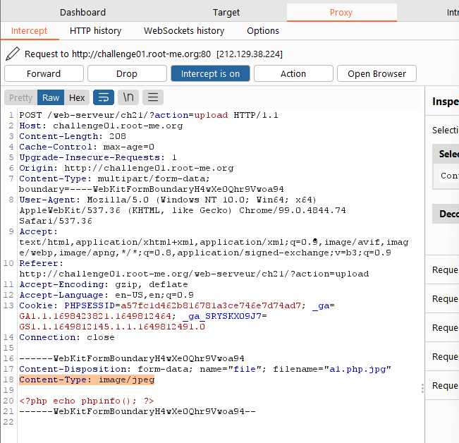
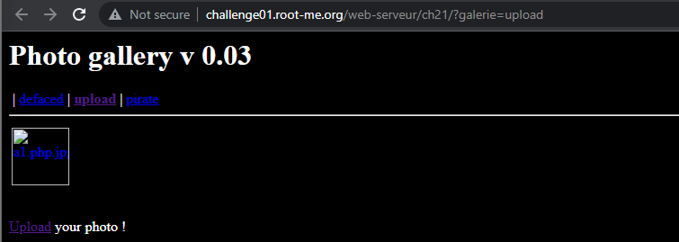
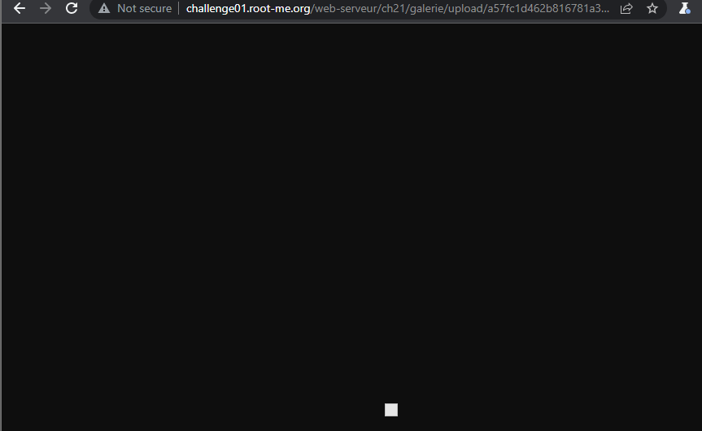
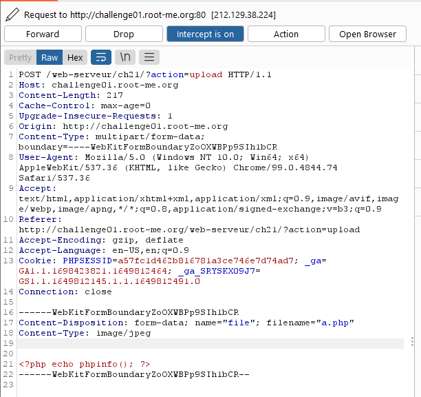
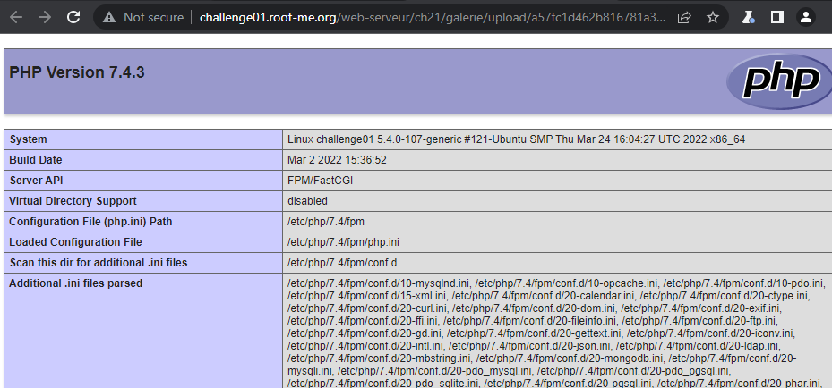
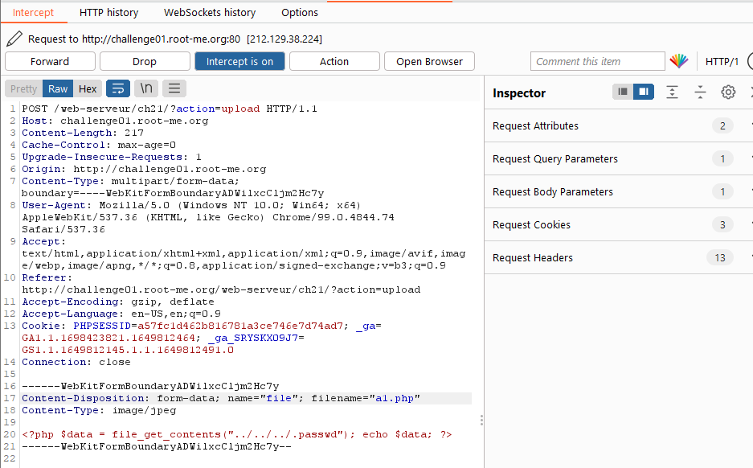
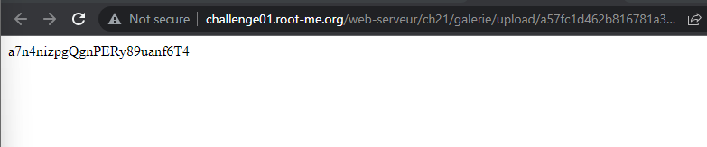

# Challenge: File upload - MIME type
## Người làm:   
    Nguyễn Ngọc Trưởng - 19522440
    Thời gian:
## Link: 
    https://www.root-me.org/en/Challenges/Web-Server/File-upload-MIME-type

- Thử thách như giống như bài trước là một trình xem ảnh cho phép upload file ảnh

- Dạo quanh trang web thì có một nơi upload file, những file upload phải có phần mở rộng là png, jpg `only .gif, .jpeg and .png are accepted`

- Ta thử upload 1 file ảnh, xử dụng BurpSuit để có thể xem và chỉnh sửa request header.

- Ta thấy khi upload ảnh, ngoài nội dung nó được gởi lên thì còn còn có Content-Type, Content-Dispositon.

- Ta xem file đã upload, dùng file của bài trước có 2 đuôi, xem thử thì không được kết quả gì.

- Bài này đề cập MIN Type, do vậy ta thử upload 1 file php và thay đổi Content-Type cho giống với khi upload ảnh (từ application/octet-stream thành image/jpeg), khi đó ta được 

- Như vậy ta đã thực thi được file php nhưng ý, ta sẽ upload đoạn mã khác để có thể đọc file .passwd, dựa vào bài trước đó, Double extension và đường dẫn của file upload ta có thể xác định được vị trí của .passwd sẽ nằm tại `../../../.passwd`
> `<?php $data = file_get_contents("../../../.passwd"); echo $data; ?>`

## Kết quả password là `a7n4nizpgQgnPERy89uanf6T4`