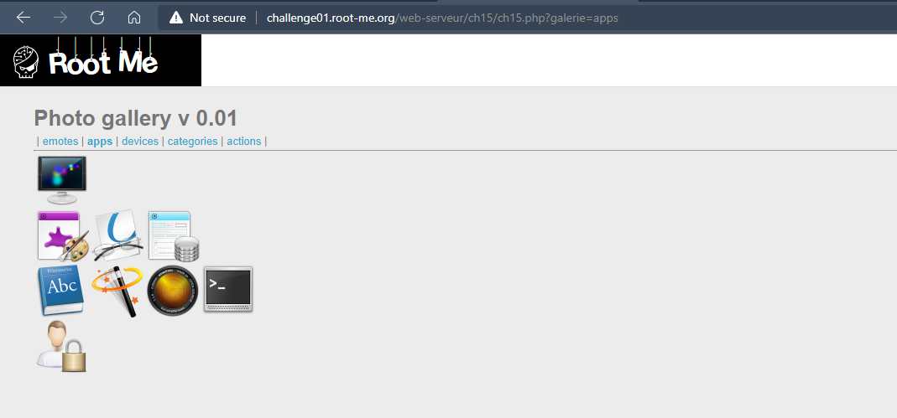
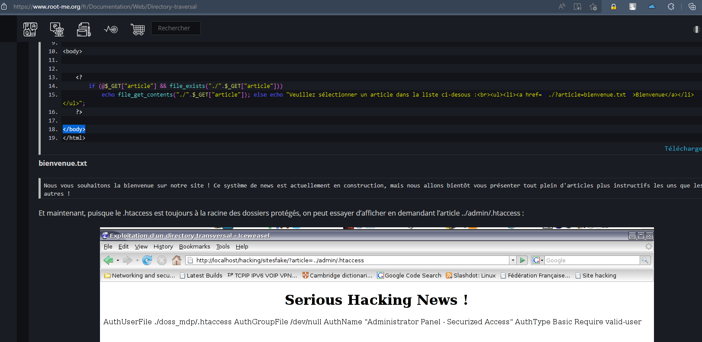
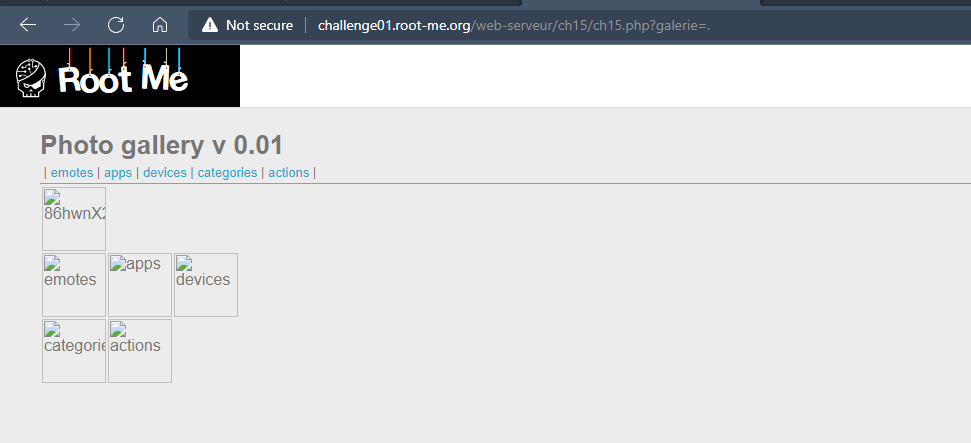
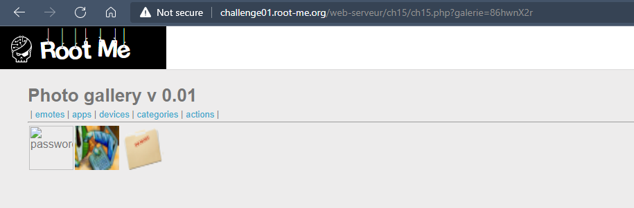
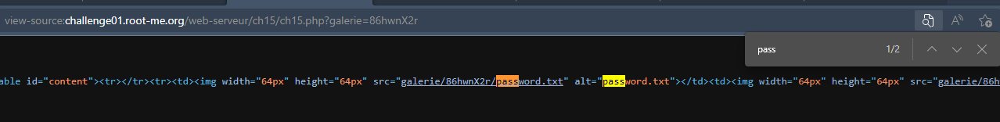
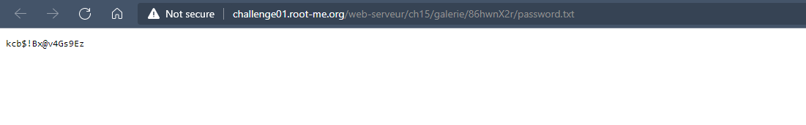

# Challenge: Directory traversal
## Người làm:   
    Nguyễn Ngọc Trưởng - 19522440
    Thời gian:
## Link: 
    https://www.root-me.org/en/Challenges/Web-Server/Directory-traversal

- Thử thách cho chúng ta những trang, trong những trang có danh sách các hình ảnh, có thể đây là liệt kê các file ảnh có trong thư mục

- Đọc bài tham khảo đính kèm trong challenge, https://www.root-me.org/fr/Documentation/Web/Directory-traversal, ta thấy bài này là liệt kê các file có trong thư mục, thư mục này được truyền vào bởi tham số galerie

- Ta thử show thư mục hiện tại bằng giá trị `galerie=.` thì ta thấy ở đây có các forder khác nhau, có 1 thư mục không được show lên trên thanh menu,

- ta thử vào đó với giá trị `galerie=86hwnX2r`, vì nó hiển thị không đầy đủ nên ta cần xem source code (crlt U)

- Ta thấy thư mục hiện tại có file passwo... ta xem source code

- Vì này là một tệp tin nên ta cũng không thể truyền vào tham số cho galerie. ta click vào link trong source code này, để truy cập vào file, khi đó ta nhận được password.

## Kết quả password là `kcb$!Bx@v4Gs9Ez`