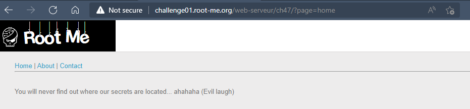
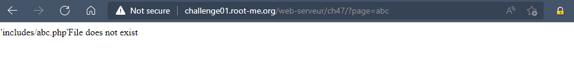
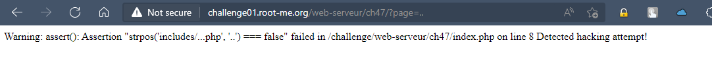
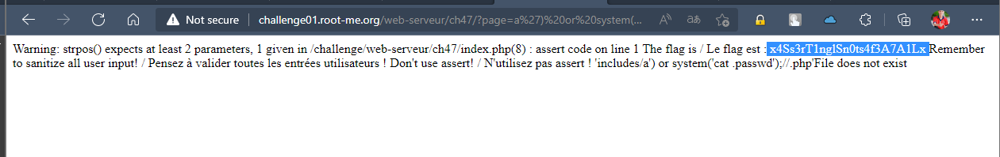

# Challenge: PHP - assert()
## Người làm:   
    Nguyễn Ngọc Trưởng - 19522440
    Thời gian:
## Link: 
    https://www.root-me.org/en/Challenges/Web-Server/PHP-assert

- Thử thách cho chúng 3 trang Home, About, Contact, 3 trang này chỉ hiển thị thông tin ra màn hình thay đổi bởi tham số page.

- Ta thử đổi giá trị của tham số page này `?page=abc`, ta thấy nó được cộng vào phần mở rộng là php, sau đó được đưa vào hàm include

- Ta thử với giá trị khác `?page=..` thì thấy nó có dùng hàm assert() để kiểm tra giá trị được nhập vào

- Dựa vào thông báo ta có dự đoán được: input sẽ được chèn vào lệnh.
> assert("strpos('includes/`[page]`.php', '..') === false")

- Tìm hiểu thì ta thấy có thể inject code vào đây, ta biết rằng password sẽ nằm tại file ./passwd. do vậy giá trị được chèn vào sẽ là `?page=a') or system('cat .passwd');//`
> Khi đó ta sẽ được 
assert("strpos('includes/`?page=a') or system('cat .passwd');//`.php', '..') === false")

- Đến đây ta nhận được giá trị của flag

## Kết quả password là `x4Ss3rT1nglSn0ts4f3A7A1Lx`